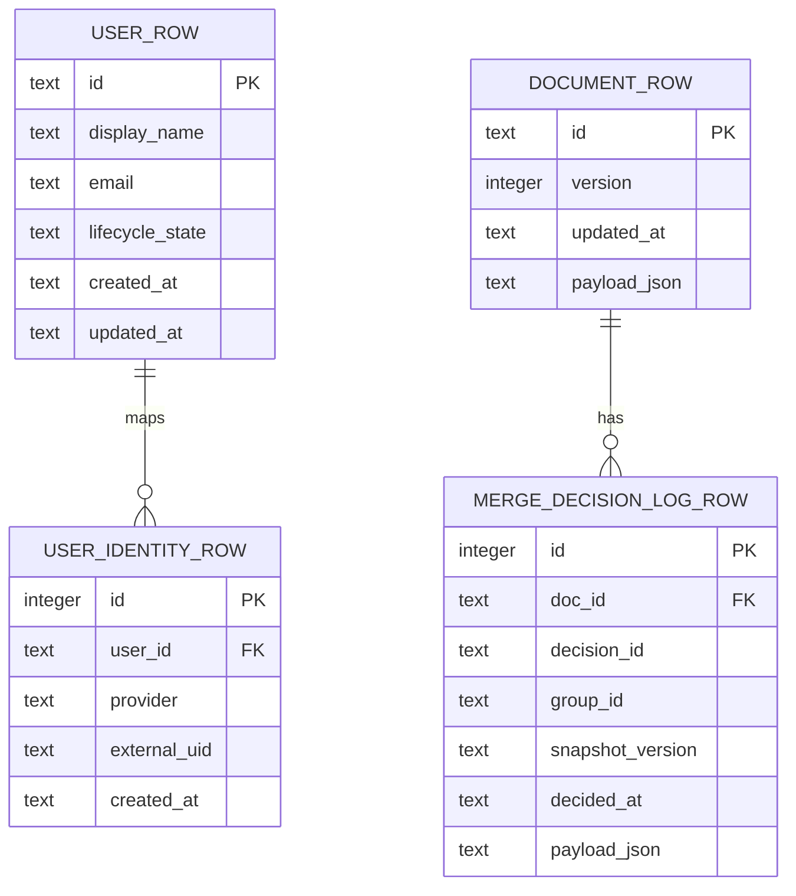
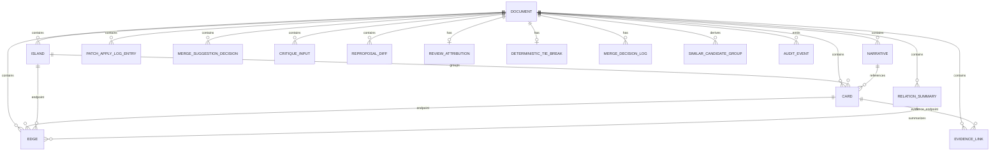

# MVPデータモデル・運用俯瞰

> 環境変数・実行パラメータの正本は `02_Architecture/runtime_parameter_registry.md`。本書ではデータ構造と運用境界のみを扱う。
> 型定義の詳細は `02_Architecture/schemas.md`、API入出力は `02_Architecture/api.md`、企業・行政運用の認証/認可境界は `02_Architecture/enterprise_architecture.md` を参照する。

2026年5月のStream D形成記録は [Data Model Operations formation history](history/data-model-operations-stream-d-2026-05.md) に分離し、本書には現行契約だけを記載する。

この文書は、kj-atlas MVPで「どのデータ構造を実際に運用できるか」と「どの構造は将来契約・派生情報・限定的な保守対象に留まるか」を俯瞰するための設計文書です。

`schemas.md` にはMVPの最小永続データに加えて、Contract Freeze、AI連携、review attribution、audit連携などの将来契約も含まれます。そのため、本書では次を明確に分けます。

- **物理永続化**: 実DBでテーブルとして持つもの。
- **論理データ構造**: `Document` のJSONスナップショット内に含まれるもの。
- **運用CRUD**: 標準APIまたは標準UIで作成・参照・更新・削除できるもの。
- **契約のみ/派生情報**: 型やI/Fは定義されているが、MVPでは完全なデータ保守手段を持たないもの。

---

## 1. MVPの基本方針

MVPは、データ構造の全てをサポートする段階ではありません。利用者が価値を確認できる最小単位として、ドキュメント全体のスナップショット保存を中心にします。

| 区分 | 意味 | MVPでの扱い |
|---|---|---|
| 運用サポート | 標準API/UIで作成・参照・更新でき、通常運用の対象になる | `Document` スナップショット、認証ユーザーの事前登録、マージ判断ログの追記/参照 |
| 埋め込み限定 | `Document` 内には保存されるが、個別エンティティとしてのCRUDを持たない | Card、Edge、Island、Narrative、RelationSummary、PatchApplyLog、ReviewAttribution など |
| 派生/読み取り中心 | 保存済みデータや入力から生成され、標準的な保守対象ではない | SimilarCandidateGroup、ContextBundle、各種 audit event |
| 契約のみ/将来拡張 | 型や境界を先に固定しているが、MVP運用の完全対象ではない | CE系Context契約、proposal/apply監査、詳細な証跡・根拠リンク管理、差分同期 |

MVPで最も重要なのは、カードやまとまりを扱えることではなく、利用者と運用者が「どこまでが正式に保守されるデータか」を誤解しないことです。

### 1.1 ADR-0033 境界クラス（固定）

本書のCRUD表・フィールド支援レベルは、ADR-0033の Support/Maintenance/Contract Boundary Table と同じ語彙で運用する。

- `L1: Supported` = 標準API/UIで日常運用できる対象（例: Document snapshot）
- `L1.5: Append-read` = 追記/参照のみを標準運用とする対象（例: merge decision log）
- `L2: Embedded-only` = Document内埋め込みで保持し、個別CRUDは提供しない対象
- `L2.5: Contract-limited` = 保存はするが個別編集UI・個別CRUDを持たない契約先行対象
- `L3: Derived` = 生成・表示対象であり永続保守対象ではない
- `L0: Planned` = MVP時点では運用手順を定義中で標準運用を保証しない

## 2. 物理永続化モデル

現行実装の物理テーブルは、論理エンティティを細かく正規化する構成ではありません。ドキュメント本体は `documents.payload_json` にスナップショットとして保存し、必要な補助ログだけを別テーブルに分離します。

| 物理テーブル | 主な責務 | 運用上の注意 |
|---|---|---|
| `documents` | `DocumentV1` のスナップショット保存 | Card/Edge/Islandなどは `payload_json` 内に埋め込まれる。個別行としては保守しない。 |
| `merge_decision_logs` | Manual assisted merge の判断ログをappend-onlyに近い形で保存 | Document本体とは分離するが、`doc_id` に従属する。通常更新・削除APIは持たない。 |
| `users` | 認証主体の内部ユーザー表現 | lifecycle stateは持つが、MVPの管理画面で全ライフサイクルを扱う段階ではない。 |
| `user_identities` | IdPなど外部認証subjectと内部ユーザーの対応 | `provider + external_uid` を内部 `user:<users.id>` に正規化する。 |

`DATA-MODEL-OPS-02`（D1〜D4、2026-07-13代理裁可）により、管理面（マスタデータ）レイヤーの正本を次のとおり固定した。いずれも新しい物理テーブルを本ER図へ追加しない。

- 文書一覧（D1）: 既存 `documents` を対象にした本文非含有の射影として提供する（新規テーブルなし）。
- View/Perspective状態、QueryPreset（D2）: 既存 `view.json` ファイルとdevice-local（browser storage）を正本のまま維持する（新規テーブルなし）。
- エージェント登録（D3）: `agent_registrations` 相当をサーバー正本として採用済みだが、実装は `EXT-CONN-02` で行う契約先行決定であり、実装されるまで本ER図には含めない。

---

## 3. 論理データモデル

次のER図は、物理テーブルではなく、`Document` スナップショット内の論理構造を示します。運用上は多くが `documents.payload_json` の中に含まれ、個別CRUDの対象ではありません。

| 論理データ | MVPでの位置づけ | 保守方法 |
|---|---|---|
| `DocumentV1` | カード、線、島、文章化、レビュー帰属、判断ログ連携などを含む唯一のスナップショット | `GET /docs/{doc_id}` と `PUT /docs/{doc_id}` で全体を取得/置換する。個別構造の完全CRUDはMVP範囲外。 |
| `Card` | 利用者が置く主要情報単位。`claimType` による事実/主張/仮説の分類を含む | 画面操作またはインポート後、ドキュメント全体保存で反映する。 |
| `Edge` | カード/島間の関係。`fromKind` / `toKind` で endpoint 種別を保持できる | 個別APIは持たず、ドキュメント全体保存で反映する。 |
| `EvidenceLink` | 根拠・反証のリンク | `DocumentV1.evidenceLinks` の埋め込み構造として保存する。個別CRUDは持たない。 |
| `Island` | まとまり、囲み、構造化の単位 | `DocumentV1` 内の埋め込み構造。shapeやreview状態の完全保守は段階導入。 |
| `Narrative` / `RelationSummary` | 文章化・要約成果物 | 共有前確認やレビューと連動するが、MVPでは個別CRUDを正本にしない。 |
| `ReviewAttribution` | 人間レビュー済み状態と主体の追跡 | `user:<users.id>` 正規化を前提にする。自動昇格は禁止。 |
| `MergeDecisionRecord` | 類似統合などの人間判断ログ | `merge_decision_logs` に追記し、group/snapshot単位で参照する。 |
| `SimilarCandidateGroup` | 類似候補の表示用派生情報 | 保存済みDocumentから導出する。通常保守対象ではない。 |
| `ContextQuery` / `ContextBundle` | AI入力・提案前の安全な文脈境界 | 契約先行。MVPではmock/検証用I/Fを含み、永続保守対象とは分ける。 |
| `InquiryJourneyV1` | W型累積KJ法のラウンドDAGを束ねる独立manifest | `ADR-0057` の採択済み設計目標。現行 `DocumentV1` へ埋め込まず、実装までは `L0` とする。 |
| `RoundSnapshotV1` | 人が確認した節目の不変な文書成果 | 意味のある配置を含む `DocumentV1` 成果を再現する。現行API・DB・標準UIでは未実装。 |
| `RepresentativeVisualCue` | 島または選択集合の再認識を助ける任意の絵文字・アイコン・画像 | `DOMAIN-VISUAL-CUE-01` / `ADR-0059` の計画対象。現行 `DocumentV1`、API、DB、標準UIには未実装で、保存先と許容素材を未決定。 |
| `SourceVisualMaterial` | 観察・取材・利用者作成で得た写真・図・スケッチと元文脈 | `DOMAIN-VISUAL-CUE-01` / `ADR-0059` で代表手掛かりと分離した計画対象。現行の標準import、保存、出典表示、削除手段は未実装。 |

---

## 4. CRUDサポート表

| データ領域 | Support level | Create | Read | Update | Delete | MVP保守責任 | 備考 |
|---|---|---|---|---|---|---|---|
| Documentスナップショット | L1 | `PUT /docs/{doc_id}` で存在しなければ作成 | `GET /docs/{doc_id}` | `PUT /docs/{doc_id}` で全体置換 | 標準APIなし | Document owner / Platform operator | API文書上の `POST /docs` は任意/将来候補として扱い、実装契約化は `DATA-CONTRACT-01` で同期する。 |
| Card / Edge | L2 | Document作成・更新に含める | Document取得に含まれる | Document全体保存で反映 | Document全体保存で除去 | Standard user / Document owner | 個別カードAPIや個別エッジAPIはMVP範囲外。`claimType` と endpoint kind はスナップショット内で往復保持する。 |
| EvidenceLink | L2 | Document作成・更新に含める | Document取得に含まれる | Document全体保存で反映 | Document全体保存で除去 | Standard user / Reviewer | 個別APIは持たない。SafeMode/share/exportでは未レビュー本文や根拠の扱いを別途確認する。 |
| Island / IslandShape | L2 | DocumentV1に含める | Document取得に含まれる | Document全体保存で反映 | Document全体保存で除去 | Standard user / Reviewer | shape再計算、階層、collapseなどはUI/実装の段階的対応が必要。 |
| Narrative / RelationSummary | L2 | DocumentV1またはexport処理に含める | Document取得またはexport成果物で参照 | Document全体保存で反映 | Document全体保存で除去 | Reviewer / Document owner | 文章化品質、根拠、未レビュー状態の表示は製品化issueで継続管理する。 |
| ReviewAttribution | L2.5 | DocumentV1更新時に含める | Document取得に含まれる | 認証主体と一致する場合のみ更新を許可 | 標準削除APIなし | Reviewer / Security officer | `human_reviewed` は人手操作のみ。AIや自動処理で昇格しない。 |
| MergeDecisionRecord | L1.5 | `POST /docs/{doc_id}/merge-decision-logs` | group/snapshot別GET | 標準更新APIなし | 標準削除APIなし | Reviewer / Audit operator | 追記ログとして扱い、訂正は新しい判断記録で表現する方針。 |
| SimilarCandidateGroup | L3 | 保存済みDocumentから導出 | `GET /docs/{doc_id}/similar-candidate-groups` | 標準更新APIなし | 標準削除APIなし | Reviewer | 結果の正しさは候補生成ロジックの検証対象で、データ保守対象ではない。 |
| ContextQuery / ContextBundle | L2.5 | request/responseとして生成 | API/CLI/contract testで参照 | 永続更新なし | 永続削除なし | Developer / AI integration owner | 契約先行。利用者データの永続保守とは分け、実装済み運用としては扱わない。 |
| Export / Context audit event | L3 | 各audit endpointで送信 | アプリ内の標準一覧APIなし。本文を含まない監査メタデータ閲覧候補は `DATA-MAINT-04` でOpen管理する | 標準更新APIなし | 標準削除APIなし | Audit operator / Security officer | 監査基盤への委譲を前提とし、アプリ本体に監査ログ閲覧UIを持たない。本文・未レビュー情報・横断検索を含む場合はADR必須。 |
| User / UserIdentity | L1 | `POST /admin/provision/users` | 標準一覧APIなし | 標準更新APIなし | 標準削除APIなし | Platform operator | strict provisioningの入口。退避、無効化、棚卸しは `DATA-MAINT-01` の対象。 |
| 文書一覧（Document index projection） | L1 | 標準Createなし（既存 `documents` の射影） | `GET /docs`（`id`/`title`/`updatedAt` のallowlistのみ、本文非含有） | 標準更新APIなし | 標準削除APIなし | Platform operator / Document owner | 対象は現認可主体がread可能な文書に限定し、owner/ACL解決不能時はfail-closed。localStorageの「最近」は非正本キャッシュへ格下げする（`DATA-MODEL-OPS-02` D1確定）。 |
| View/Perspective状態 | L2 | 既存 `view.json` 保存に含める | 既存 `view.json` 取得に含まれる | 既存 `view.json` 保存で反映 | ファイル管理に依存 | Standard user | `DocumentV1` へ埋め込まず、既存 `view.json.viewState` を正本とする（`DATA-MODEL-OPS-02` D2確定）。 |
| QueryPreset（Patch workspace） | L3 | device-local（browser storage） | device-local | device-local | device-local | Standard user | 当面device-localを維持し、UIで「この端末のみ」と明示する。利用実績なしにユーザー従属テーブルを新設しない（`DATA-MODEL-OPS-02` D2確定）。 |
| エージェント登録（`agent_registrations`） | L0 | `POST /admin/agent-registrations`（契約先行、実装は`EXT-CONN-02`） | `GET /admin/agent-registrations`（`token`/`tokenHash`非含有、契約先行） | 標準更新APIなし | `DELETE /admin/agent-registrations/{id}`（失効、契約先行） | 将来: Platform operator（admin strict provisioning限定） | サーバー正本として採用済み（`DATA-MODEL-OPS-02` D3確定）。登録・失効はadminのstrict provisioning型操作に限定し、平文tokenは作成時に一度だけ表示・以後はhashのみで照合する。登録自体は文書書込権限とみなさず、ingestごとに別途許可判定する。API型契約は `api.md` §9.5 に先行固定済み。実装は `EXT-CONN-02` で行う（`DATA-MODEL-OPS-02` AC-5）。 |
| Import/Review Pack artifact | L3 | import/export処理で生成・取込 | ファイルまたはUI上の結果で参照 | 再export/再importで更新 | ファイル管理に依存 | Standard user / Document owner | DBの正本ではなく、共有・移行用成果物として扱う。 |
| InquiryJourney / RoundSnapshot | L0 | 標準経路なし | 標準経路なし | 標準経路なし | 標準経路なし | 将来: Standard user / Document owner | `ADR-0057` は独立探究 + 不変成果DAG + 自己完結bundleを採択済み。型・fixture・操作模型・roundtrip・削除境界を `DOMAIN-W-ITERATION-01` で検証するまで、現行CRUD対応を主張しない。 |
| RepresentativeVisualCue / image asset | L0 | 標準経路なし | 標準経路なし | 標準経路なし | 標準経路なし | 将来: Standard user / Document owner | `ADR-0059` はProposed。手描き・基本図形・利用者画像、Unicode絵文字・同梱素材、外部素材、生成画像の供給経路と、採用参照・権利情報・画像本体・サムネイルの保存をfixtureで比較するまで、`DocumentV1`やDBへ追加しない。 |
| SourceVisualMaterial | L0 | 標準経路なし | 標準経路なし | 標準経路なし | 標準経路なし | 将来: Field worker / Standard user / Document owner | 写真・図が観察データや根拠である場合の計画対象。代表表示の切り抜きと元資料・撮影文脈・出典を分離し、容量・機微情報・削除を決めるまで現行CRUD対応を主張しない。 |

---

### 4.1 DocumentV1フィールド支援レベル表

`DocumentV1` は全フィールドを個別運用できるという意味ではありません。次の表は、frontend/backend/API/設計上の現在の扱いを、保守レベルとして固定します。

| フィールド | Support level | frontend型 | backend保存/検証 | MVP保守レベル | 次アクション |
|---|---|---|---|---|---|
| `version` / `id` / `createdAt` / `updatedAt` / `transform` | L1 | 必須 | 必須 | 運用サポート | `PUT /docs/{doc_id}` のCreate/Update契約で維持する。 |
| `cards[]` | L2 | `Card[]`。`claimType`、統合元、批評、レビュー状態を含む | `Card[]` として保存。`claimType` も往復保持する | 埋め込み限定 | 個別カードCRUDは作らず、スナップショット保存の互換を維持する。 |
| `edges[]` | L2 | `Edge[]`。`fromKind` / `toKind` を含む | `Edge[]` として保存。endpoint kind も往復保持する | 埋め込み限定 | 島endpointを含む関係のUI/API検証を `DATA-CONTRACT-01` で継続する。 |
| `islands[]` | L2 | `Island[]`。階層、collapse、shape、summaryを含む | 保存/検証あり。geometry/shapeの互換正規化あり | 埋め込み限定 | shape再計算、階層、collapseの個別保守は製品化issueで扱う。 |
| `readingOrder` | L2 | optional | optional | 埋め込み限定 | 文章化・共有時の読み順として扱う。 |
| `narratives` | L2 | optional | optional | 埋め込み限定 | 個別CRUDではなく、成果物化と共有前確認で扱う。 |
| `relationSummaries` | L2 | optional | optional。本文長上限あり | 埋め込み限定 | 要約品質、根拠、レビュー状態の検証を継続する。 |
| `evidenceLinks` | L2 | optional。根拠/反証リンク | optional。往復保持する | 埋め込み限定 | share/exportとSafeModeでの表示・抑制条件を `PRODUCT-VALUE-02/03` と同期する。 |
| `patchApplyLog` | L2 | optional。evidence件数を含むstats | optional。evidence件数を保持し、旧データは0として補完する | 埋め込み限定 | patch適用監査の保持範囲を `DATA-CONTRACT-01` で継続確認する。 |
| `mergeSuggestionDecisions` | L2 | optional | optional | 埋め込み限定 | append-onlyの `merge_decision_logs` と混同しない。 |
| `critiqueInputs` / `reproposalDiffs` | L2.5 | optional。A1契約型として掲載し、strict/import検証で往復保持 | backend契約型として保存。`island:` targetRef と片側 `null` の可逆差分を許可 | 契約のみ/限定保存 | 個別編集UIや個別CRUDはMVP範囲外。SafeMode/share/exportでの扱いはテスト観点に残す。 |
| `reviewAttribution` | L2.5 | optional。A1契約型として掲載し、`reviewedAt` の状態別制約と生ID禁止を検証 | backend契約型として保存。認証主体一致を検証 | 契約のみ/限定保存 | review attribution正本との同期を継続し、監査閲覧・検索は製品化issueで扱う。 |
| `deterministicTieBreak` | L2.5 | optional。固定順序をstrict/import検証で保持 | backend契約型として保存 | 契約のみ/限定保存 | polygon handoff契約との関係を維持する。 |
| `cards[].meta`（`seq`/`source`） | L2.5 | optional。通し番号と原データ遡及参照（schemas.md §15）。meta内の未知キーはfail-closedで破棄 | `CardMeta` として保存。未知キーは受理しない | 契約のみ/限定保存 | 共有向け書き出しは既定除外＋明示トグル（§15.4）。起票者等の主体メタは `CARD-META-UI-01` の確定まで追加しない。 |
| `contradictionSignalDecisions` | L2.5 | optional。矛盾シグナル（`analyzeContradictions()`）への人間レビュー決定（採用/保留/却下、schemas.md §16） | optional。往復保持し、不正要素は破棄する | 契約のみ/限定保存 | AI/検出ロジックは書き込み経路を持たない（ADR-0041 CVI-2）。review pack/narrative契約は変更しない。 |
| `cards[].ka`（`voice`/`value`） | L2.5 | optional。KA法の心の声・価値（schemas.md §17）。`text`（出来事の正本）とは別フィールドで併記しない | `CardKa` として保存。両方欠落/空文字なら `ka` 自体を省略 | 契約のみ/限定保存 | カード面（キャンバス）には表示しない。narrative export/review pack は既定OFFの任意セクション。SafeMode露出判定は `card.text` と同一チャネル。 |

### 4.2 DocumentV1サポートレベルとOpen化ゲート

- `DocumentV1` の運用境界は `L1/L1.5/L2/L2.5/L3/L0` で固定し、`schemas.md` の versioning ルールと同時更新を必須とする。
- Open化（実装チーム着手可）条件:
  1) `schemas.md` の versioning / support level定義が更新済みである。
  2) 本書のCRUD表とフィールド支援表が同じ語彙（L1〜L0）で同期されている。
  3) `DATA-CONTRACT-01` / `DATA-MODEL-OPS-01` / `DATA-MAINT-01` のACに、同じ境界分類と検証レベルが反映されている。
- 非互換変更は feature flag ではなく **version gate優先** とし、gate未導入時は契約変更を行わない（fail-closed）。

---

## 5. ステークホルダー別の運用境界

| ステークホルダー | 期待される操作 | MVPで保証する範囲 | 製品化に向けた不足 |
|---|---|---|---|
| Standard user | カードを置く、関係を見る、保存する、共有前確認を行う | ドキュメント単位の保存/復元と、SafeMode前提の共有導線 | 個別カード履歴、誤操作復元、一覧/検索、共同編集 |
| Reviewer | 要約、候補、レビュー状態、判断ログを確認する | 人間判断ログとreview attributionの境界 | レビュー作業キュー、差分比較、レビュー証跡の検索 |
| Document owner | ドキュメントの内容と共有範囲を管理する | ドキュメント全体更新、export/review pack | 削除/アーカイブ、所有者移管、保管期限 |
| Platform operator | DB接続、バックアップ、復旧、ユーザー事前登録を管理する | SQLite/PostgreSQL切替、admin provisioning | 管理UI、棚卸し、データ検証、復旧手順の標準化 |
| Security officer | SafeMode、監査連携、未レビュー情報の共有抑制を確認する | SafeMode既定ON、audit endpoint、strict provisioning | 監査ログ閲覧、例外承認とデータライフサイクルの統合 |
| Support | 利用者から再現情報を受け取り、問題を切り分ける | diagnosticsや共有前確認の情報を補助的に利用 | 個人情報を含まない支援パッケージ、データ破損時の安全な切り戻し |
| Developer / Maintainer | スキーマ、API、移行、テストを維持する | 契約文書、型、単体/結合テスト | DocumentV1の正本同期、マイグレーション、互換性ゲート |

### 5.1 管理・復旧・棚卸しの最小運用境界（DATA-MAINT-01）

`DATA-MAINT-01` では、MVPのデータ構造をすべて管理対象に広げるのではなく、運用者が本番導入前に最低限確認できる読み取り・退避・復旧確認を先に固定する。`ADR-0035` は2026-07-13にAcceptedされ、利用者本文、未レビュー情報、所有権、削除、アーカイブ、保管期限のように組織方針と監査責任を変える操作を標準機能にしない境界を固定した。

| 運用 | 主担当 / 承認 | 対象データ | MVPで許容する手段 | 必須確認 | Stop / ADR化条件 |
|---|---|---|---|---|---|
| ドキュメント棚卸し | Platform operator / System owner | `documents`（L1） | 読み取り専用のDB確認または将来CLI/API候補。標準一覧APIや管理UIは未提供。 | 件数、`id`、`version`、`updated_at`、JSON構造の妥当性を確認し、`payload_json`本文の閲覧を運用標準にしない。 | 一般管理UI、検索、本文閲覧、利用者向け一覧を実装する場合は別issue。 |
| ユーザー棚卸し | Platform operator / Security officer | `users`, `user_identities`（L1） | strict provisioning の登録結果を読み取りで確認する。ライフサイクル管理UIは未提供。 | `provider` + `external_uid` の重複、無効化予定ユーザー、登録主体と監査責任の整合を確認する。 | 無効化、削除、SCIM、権限ロール管理を製品機能にする場合はADR。 |
| バックアップ | Platform operator / System owner | SQLite/PostgreSQLの永続DB | 環境標準のDBバックアップを用いる。SQLiteはDBファイルの停止時スナップショット、PostgreSQLは`pg_dump`等を候補にする。 | DB種別、取得日時、アプリrevision、秘匿情報の保護、バックアップ保管先を記録する。 | 保持期間、暗号化、外部保管を製品標準として固定する場合は組織方針またはADR。 |
| 復旧確認 | Platform operator / Document owner | `documents`, `merge_decision_logs` | まず検証環境へ復元し、Document再投入またはDB restoreのどちらで復旧したかを記録する。 | `Document.version`、schema version gate、`merge_decision_logs.doc_id`、判断ログの時系列、L1/L1.5優先復旧を確認する。 | 本番への破壊的restore、互換性不明なDocumentの受け入れ、ログ欠落を伴う復旧はStop。 |
| 支援用情報の共有 | Support / Security officer | diagnostics、共有前確認結果、非機微メタデータ | SafeMode既定ONの範囲で、本文を含まない再現情報と設定状態を共有する。 | PII、未レビュー本文、根拠未確認の要約、組織秘密を除外したことを確認する。 | サポート担当の本文閲覧、管理者横断閲覧、未レビュー情報の共有を許可する場合はADR。 |
| アーカイブ・削除・所有者移管 | Document owner / Security officer | `documents`, `merge_decision_logs`, review attribution | MVPでは実装しない。必要性とリスクを分類し、直接DB操作を標準手順にしない。 | 削除対象、判断ログ保持、所有者変更の監査責任、復旧不能性を事前に記録する。 | いずれかを製品機能として実装する場合はADRと専用issueが必須。 |

読み取り中心の棚卸しとバックアップ/復旧演習は、現時点では運用設計と検証観点の対象とする。書き込み系の管理操作は、認可・監査・データライフサイクルの合意が揃うまで実装対象に含めない。

### 5.2 Workspace / Admin・Audit の表示分離（DATA-MODEL-OPS-02 D4）

`DATA-MODEL-OPS-02` D4（2026-07-13代理裁可）により、通常利用者のWorkspace文書一覧とAdmin/Audit管理面の表示範囲を分離する。

- Workspace文書一覧（Standard user / Document owner）: 認可済み文書のタイトルを表示できる。対象は「文書一覧（Document index projection）」（§4）に従う。
- Admin/Audit管理面（Platform operator / Security officer / Audit operator）: `id` / `version` / `updatedAt` 等の固定allowlistだけを扱う。タイトル、`payload_json`、カード、narrative、review pack、diff、未レビュー本文は表示・検索の対象にしない。

この分離は表示範囲の原則であり、Admin/Audit向けの新しい一覧APIやUIの実装可否そのものを決めるものではない。実装する場合は、この allowlist 境界と `ADR-0035` の高権限操作境界を維持する。

---

## 6. 運用設計の不足と起票先

MVPの制約を明示したうえで、ステークホルダー運用に耐える構成へ進めるため、次のADR/issueで継続管理します。

| ID | 内容 | 管理先 |
|---|---|---|
| `ADR-0033` | MVPデータサポート境界と保守方針を固定する | `01_Plans/adr/ADR-0033-mvp-data-support-and-maintenance-boundary.md` |
| `ADR-0035` | 高権限データライフサイクル操作を標準管理機能にしない境界を固定する（Accepted 2026-07-13） | `01_Plans/adr/ADR-0035-privileged-data-lifecycle-boundary.md` |
| `DATA-MODEL-OPS-01` | ER/CRUD俯瞰とサポートレベル表の継続更新 | `01_Plans/issues/issue-DATA-MODEL-OPS-01-mvp-data-model-overview-and-crud-boundary.md` |
| `DATA-MODEL-OPS-02` | 管理面（マスタデータ）レイヤー（文書一覧/プリセット/エージェント登録）の境界固定とサーバー正本化（D1〜D4確定、実装は別途） | `01_Plans/issues/issue-DATA-MODEL-OPS-02-management-plane-data-boundary.md` |
| `DATA-MAINT-01` | 管理・復旧・棚卸し・データ保管運用の設計 | `01_Plans/issues/issue-DATA-MAINT-01-admin-maintenance-and-recovery-operations.md` |
| `DATA-MAINT-03` | 高権限データライフサイクル操作を標準機能にしない分類判断（Done / Fixed） | `01_Plans/issues/issue-DATA-MAINT-03-high-privilege-data-lifecycle-policy.md` |
| `DATA-MAINT-04` | 本文を含まない監査メタデータ閲覧候補のOpen境界 | `01_Plans/issues/issue-DATA-MAINT-04-metadata-only-audit-viewing.md` |
| `DATA-CONTRACT-01` | DocumentV1/API/frontend/backend間の契約ドリフト解消 | `01_Plans/issues/issue-DATA-CONTRACT-01-document-v2-contract-drift-and-support-levels.md` |
| `CARD-META-UI-01` | カード起票者・出典などのprovenanceメタデータUI境界 | `01_Plans/issues/issue-CARD-META-UI-01-card-provenance-metadata-ui-boundary.md` |

`DATA-MAINT-01` は、読み取り専用の棚卸し候補、SQLite/PostgreSQL別のバックアップ/復旧演習、削除・アーカイブ・所有者移管・管理者本文閲覧のStop条件を管理する。`DATA-MAINT-03` とAccepted済み `ADR-0035` により、これらの高権限操作は標準機能外と確定した。本文を含まない監査メタデータ閲覧だけは `DATA-MAINT-04` でOpenとして分離するが、Open化は実装許可ではない。標準管理画面や書き込み系管理APIを追加する場合は、一般利用者の操作導線から分離し、監査・認可・データライフサイクルの契約を先行させる。

カード上の状態メタデータ（主張種別、保留、違和感、未レビュー）は既存UIで段階的に扱う。一方で、起票者、作成者、出典、取り込み元、最終更新者などの provenance/accountability メタデータは、個人情報・共有/export・review attribution・所有者移管と衝突しやすい。これらを標準UIまたは `Card.meta` として扱う場合は、`CARD-META-UI-01` でUI境界、保存境界、redaction方針、ADR要否を先に確認する。

現行MVPのカード詳細パネルでは、既存スキーマから導出できるカードID、代表カード/出典カードの区別、ドキュメントの作成日時・更新日時だけを「記録情報」として表示する。起票者、作成者、最終更新者、レビュー者などの責任主体は現行データモデルにないため、UIで補完・推測せず「提供していない」と扱う。`Card.meta.seq` / `Card.meta.source` は既存の遡及情報エディタで扱う非主体メタであり、責任主体メタを追加したことを意味しない。この表示追加は保存契約、import受理キー、共有/exportの既定値、SafeModeの境界を変更しない。

### 6.1 カードメタデータの表示・操作境界

| 分類 | 現行の例 | 表示・操作 | 保存・共有境界 |
| --- | --- | --- | --- |
| 状態メタデータ | `claimType`, `holdState`, `critiqueTags`, `textReviewed` | カード上の短いバッジと選択時の詳細で確認・編集する | `DocumentV1.cards[]` の既存契約に従う |
| 非主体の遡及情報 | `Card.meta.seq`, `Card.meta.source`, `Card.sources` | `seq` / `source` は遡及情報エディタ、`Card.sources` は代表カードと出典カードの関係として表示する。両者を混同しない | 共有向け書き出しでは既定除外。既存の「出典参照を含める」を明示選択した場合だけ含める |
| レビュー帰属 | `reviewState`, `reviewAttribution` | レビュー状態と「誰がレビューしたか」の設計であり、起票者や作成者を表さない | `review_attribution.md` の人手昇格・redaction境界に従う |
| 責任主体メタデータ | 起票者、作成者、最終更新者、所有者 | 現行MVPでは保存・編集・推測しない。カード本体へ常設せず、「記録情報」で提供していないことを説明する | importの未知キーは受理せず、共有/export/review pack/外部エージェント依頼にも含めない |
| 公開説明用の出所分類 | 利用者入力、import由来、AI提案由来 | 現行スキーマから確実に導出できない分類は表示しない | 将来追加時も個人識別子とは別の列挙として判断する |

「記録情報」は初期状態で折りたたみ、選択したカードの補助情報として右側パネルに置く。マウスでは見出しをクリックし、キーボードではカードへTabで移動してEnterまたはSpaceで選択した後、見出しへTabで移動してEnterまたはSpaceで展開できる。展開後の項目は読み取り専用であり、フォーカス可能な編集欄を増やさない。日時はUIの言語に合う形式で表示し、元のISO日時は`time`要素の`dateTime`として保持する。未設定の値は推測せず「利用できません」、データモデル自体にない責任主体は「提供していません」と区別する。

共有前確認の「出典参照」は非主体の `seq` / `source` だけを対象とし、責任主体メタデータの同梱許可には使わない。SafeModeの状態にかかわらず既定OFFを維持する。importでは `Card.meta` の既知キーだけを受理し、未知の `author`、`creator`、`owner` 等を権限、所有、レビュー済みの根拠として扱わない。

---

## 7. 更新ルール

- 新しい永続テーブル、Document内エンティティ、または標準APIを追加した場合は、本書のER図とCRUD表を同時に更新する。
- 「型がある」ことを「MVPで保守できる」こととして扱わない。CRUD表で保守手段が空欄になる場合は、契約のみ/派生/将来拡張として明示する。
- 利用者や運用者の責任が増える変更は、`01_Plans/issues/` に受入条件と検証レベルを起票する。
- データライフサイクル、削除、監査、所有者移管など、組織運用上の方針を変える変更はADR化する。
