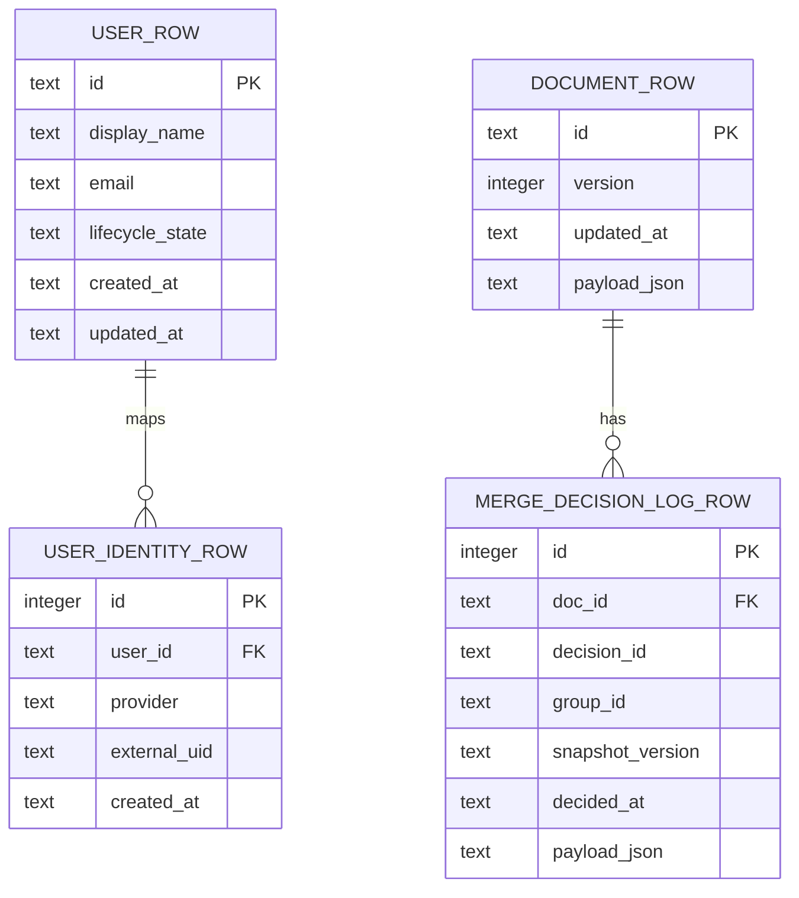
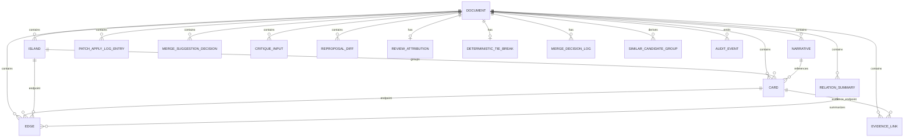

# MVPデータモデル・運用俯瞰

> 環境変数・実行パラメータの正本は `02_Architecture/runtime_parameter_registry.md`。本書ではデータ構造と運用境界のみを扱う。
> 型定義の詳細は `02_Architecture/schemas.md`、API入出力は `02_Architecture/api.md`、企業・行政運用の認証/認可境界は `02_Architecture/enterprise_architecture.md` を参照する。

この文書は、kj-atlas MVPで「どのデータ構造を実際に運用できるか」と「どの構造は将来契約・派生情報・限定的な保守対象に留まるか」を俯瞰するための設計文書です。

`schemas.md` にはMVPの最小永続データに加えて、Contract Freeze、AI連携、review attribution、audit連携などの将来契約も含まれます。そのため、本書では次を明確に分けます。

- **物理永続化**: 実DBでテーブルとして持つもの。
- **論理データ構造**: `Document` のJSONスナップショット内に含まれるもの。
- **運用CRUD**: 標準APIまたは標準UIで作成・参照・更新・削除できるもの。
- **契約のみ/派生情報**: 型やI/Fは定義されているが、MVPでは完全なデータ保守手段を持たないもの。

---

## 1. MVPの基本方針

MVPは、データ構造の全てをサポートする段階ではありません。利用者が価値を確認できる最小単位として、ドキュメント全体のスナップショット保存を中心にします。

| 区分 | 意味 | MVPでの扱い |
|---|---|---|
| 運用サポート | 標準API/UIで作成・参照・更新でき、通常運用の対象になる | `Document` スナップショット、認証ユーザーの事前登録、マージ判断ログの追記/参照 |
| 埋め込み限定 | `Document` 内には保存されるが、個別エンティティとしてのCRUDを持たない | Card、Edge、Island、Narrative、RelationSummary、PatchApplyLog、ReviewAttribution など |
| 派生/読み取り中心 | 保存済みデータや入力から生成され、標準的な保守対象ではない | SimilarCandidateGroup、ContextBundle、各種 audit event |
| 契約のみ/将来拡張 | 型や境界を先に固定しているが、MVP運用の完全対象ではない | CE系Context契約、proposal/apply監査、詳細な証跡・根拠リンク管理、差分同期 |

MVPで最も重要なのは、カードやまとまりを扱えることではなく、利用者と運用者が「どこまでが正式に保守されるデータか」を誤解しないことです。

### 1.1 ADR-0033 境界クラス（固定）

本書のCRUD表・フィールド支援レベルは、ADR-0033の Support/Maintenance/Contract Boundary Table と同じ語彙で運用する。

- `L1: Supported` = 標準API/UIで日常運用できる対象（例: Document snapshot）
- `L1.5: Append-read` = 追記/参照のみを標準運用とする対象（例: merge decision log）
- `L2: Embedded-only` = Document内埋め込みで保持し、個別CRUDは提供しない対象
- `L2.5: Contract-limited` = 保存はするが個別編集UI・個別CRUDを持たない契約先行対象
- `L3: Derived` = 生成・表示対象であり永続保守対象ではない
- `L0: Planned` = MVP時点では運用手順を定義中で標準運用を保証しない

---

## 2. 物理永続化モデル

現行実装の物理テーブルは、論理エンティティを細かく正規化する構成ではありません。ドキュメント本体は `documents.payload_json` にスナップショットとして保存し、必要な補助ログだけを別テーブルに分離します。

| 物理テーブル | 主な責務 | 運用上の注意 |
|---|---|---|
| `documents` | `DocumentV1` / `DocumentV2` のスナップショット保存 | Card/Edge/Islandなどは `payload_json` 内に埋め込まれる。個別行としては保守しない。 |
| `merge_decision_logs` | Manual assisted merge の判断ログをappend-onlyに近い形で保存 | Document本体とは分離するが、`doc_id` に従属する。通常更新・削除APIは持たない。 |
| `users` | 認証主体の内部ユーザー表現 | lifecycle stateは持つが、MVPの管理画面で全ライフサイクルを扱う段階ではない。 |
| `user_identities` | IdPなど外部認証subjectと内部ユーザーの対応 | `provider + external_uid` を内部 `user:<users.id>` に正規化する。 |

---

## 3. 論理データモデル

次のER図は、物理テーブルではなく、`Document` スナップショット内の論理構造を示します。運用上は多くが `documents.payload_json` の中に含まれ、個別CRUDの対象ではありません。

| 論理データ | MVPでの位置づけ | 保守方法 |
|---|---|---|
| `DocumentV1` | 最小スナップショット。カード、線、表示変換を持つ | `GET /docs/{doc_id}` と `PUT /docs/{doc_id}` でドキュメント全体を取得/置換する。 |
| `DocumentV2` | 島、文章化、レビュー帰属、判断ログ連携などを含む拡張スナップショット | 全体スナップショットとして保存する。個別構造の完全CRUDはMVP範囲外。 |
| `Card` | 利用者が置く主要情報単位。`claimType` による事実/主張/仮説の分類を含む | 画面操作またはインポート後、ドキュメント全体保存で反映する。 |
| `Edge` | カード/島間の関係。`fromKind` / `toKind` で endpoint 種別を保持できる | 個別APIは持たず、ドキュメント全体保存で反映する。 |
| `EvidenceLink` | 根拠・反証のリンク | `DocumentV2.evidenceLinks` の埋め込み構造として保存する。個別CRUDは持たない。 |
| `Island` | まとまり、囲み、構造化の単位 | `DocumentV2` 内の埋め込み構造。shapeやreview状態の完全保守は段階導入。 |
| `Narrative` / `RelationSummary` | 文章化・要約成果物 | 共有前確認やレビューと連動するが、MVPでは個別CRUDを正本にしない。 |
| `ReviewAttribution` | 人間レビュー済み状態と主体の追跡 | `user:<users.id>` 正規化を前提にする。自動昇格は禁止。 |
| `MergeDecisionRecord` | 類似統合などの人間判断ログ | `merge_decision_logs` に追記し、group/snapshot単位で参照する。 |
| `SimilarCandidateGroup` | 類似候補の表示用派生情報 | 保存済みDocumentから導出する。通常保守対象ではない。 |
| `ContextQuery` / `ContextBundle` | AI入力・提案前の安全な文脈境界 | 契約先行。MVPではmock/検証用I/Fを含み、永続保守対象とは分ける。 |

---

## 4. CRUDサポート表

| データ領域 | Create | Read | Update | Delete | MVP保守責任 | 備考 |
|---|---|---|---|---|---|---|
| Documentスナップショット | `PUT /docs/{doc_id}` で存在しなければ作成 | `GET /docs/{doc_id}` | `PUT /docs/{doc_id}` で全体置換 | 標準APIなし | Document owner / Platform operator | API文書上の `POST /docs` は任意/将来候補として扱い、実装契約化は `DATA-CONTRACT-01` で同期する。 |
| Card / Edge | Document作成・更新に含める | Document取得に含まれる | Document全体保存で反映 | Document全体保存で除去 | Standard user / Document owner | 個別カードAPIや個別エッジAPIはMVP範囲外。`claimType` と endpoint kind はスナップショット内で往復保持する。 |
| EvidenceLink | Document作成・更新に含める | Document取得に含まれる | Document全体保存で反映 | Document全体保存で除去 | Standard user / Reviewer | 個別APIは持たない。SafeMode/share/exportでは未レビュー本文や根拠の扱いを別途確認する。 |
| Island / IslandShape | DocumentV2に含める | Document取得に含まれる | Document全体保存で反映 | Document全体保存で除去 | Standard user / Reviewer | shape再計算、階層、collapseなどはUI/実装の段階的対応が必要。 |
| Narrative / RelationSummary | DocumentV2またはexport処理に含める | Document取得またはexport成果物で参照 | Document全体保存で反映 | Document全体保存で除去 | Reviewer / Document owner | 文章化品質、根拠、未レビュー状態の表示は製品化issueで継続管理する。 |
| ReviewAttribution | DocumentV2更新時に含める | Document取得に含まれる | 認証主体と一致する場合のみ更新を許可 | 標準削除APIなし | Reviewer / Security officer | `human_reviewed` は人手操作のみ。AIや自動処理で昇格しない。 |
| MergeDecisionRecord | `POST /docs/{doc_id}/merge-decision-logs` | group/snapshot別GET | 標準更新APIなし | 標準削除APIなし | Reviewer / Audit operator | 追記ログとして扱い、訂正は新しい判断記録で表現する方針。 |
| SimilarCandidateGroup | 保存済みDocumentから導出 | `GET /docs/{doc_id}/similar-candidate-groups` | 標準更新APIなし | 標準削除APIなし | Reviewer | 結果の正しさは候補生成ロジックの検証対象で、データ保守対象ではない。 |
| ContextQuery / ContextBundle | request/responseとして生成 | API/CLI/contract testで参照 | 永続更新なし | 永続削除なし | Developer / AI integration owner | 契約先行。利用者データの永続保守とは分け、実装済み運用としては扱わない。 |
| Export / Context audit event | 各audit endpointで送信 | アプリ内の標準一覧APIなし | 標準更新APIなし | 標準削除APIなし | Audit operator / Security officer | 監査基盤への委譲を前提とし、アプリ本体に監査ログ閲覧UIを持たない。 |
| User / UserIdentity | `POST /admin/provision/users` | 標準一覧APIなし | 標準更新APIなし | 標準削除APIなし | Platform operator | strict provisioningの入口。退避、無効化、棚卸しは `DATA-MAINT-01` の対象。 |
| Import/Review Pack artifact | import/export処理で生成・取込 | ファイルまたはUI上の結果で参照 | 再export/再importで更新 | ファイル管理に依存 | Standard user / Document owner | DBの正本ではなく、共有・移行用成果物として扱う。 |

---

### 4.1 DocumentV2フィールド支援レベル表

`DocumentV2` は全フィールドを個別運用できるという意味ではありません。次の表は、frontend/backend/API/設計上の現在の扱いを、保守レベルとして固定します。

| フィールド | frontend型 | backend保存/検証 | MVP保守レベル | 次アクション |
|---|---|---|---|---|
| `version` / `id` / `createdAt` / `updatedAt` / `transform` | 必須 | 必須 | 運用サポート | `PUT /docs/{doc_id}` のCreate/Update契約で維持する。 |
| `cards[]` | `Card[]`。`claimType`、統合元、批評、レビュー状態を含む | `CardV2[]` として保存。`claimType` も往復保持する | 埋め込み限定 | 個別カードCRUDは作らず、スナップショット保存の互換を維持する。 |
| `edges[]` | `Edge[]`。`fromKind` / `toKind` を含む | `EdgeV2[]` として保存。endpoint kind も往復保持する | 埋め込み限定 | 島endpointを含む関係のUI/API検証を `DATA-CONTRACT-01` で継続する。 |
| `islands[]` | `Island[]`。階層、collapse、shape、summaryを含む | 保存/検証あり。geometry/shapeの互換正規化あり | 埋め込み限定 | shape再計算、階層、collapseの個別保守は製品化issueで扱う。 |
| `readingOrder` | optional | optional | 埋め込み限定 | 文章化・共有時の読み順として扱う。 |
| `narratives` | optional | optional | 埋め込み限定 | 個別CRUDではなく、成果物化と共有前確認で扱う。 |
| `relationSummaries` | optional | optional。本文長上限あり | 埋め込み限定 | 要約品質、根拠、レビュー状態の検証を継続する。 |
| `evidenceLinks` | optional。根拠/反証リンク | optional。往復保持する | 埋め込み限定 | share/exportとSafeModeでの表示・抑制条件を `PRODUCT-VALUE-02/03` と同期する。 |
| `patchApplyLog` | optional。evidence件数を含むstats | optional。evidence件数を保持し、旧データは0として補完する | 埋め込み限定 | patch適用監査の保持範囲を `DATA-CONTRACT-01` で継続確認する。 |
| `mergeSuggestionDecisions` | optional | optional | 埋め込み限定 | append-onlyの `merge_decision_logs` と混同しない。 |
| `critiqueInputs` / `reproposalDiffs` | optional。A1契約型として掲載し、strict/import検証で往復保持 | backend契約型として保存。`island:` targetRef と片側 `null` の可逆差分を許可 | 契約のみ/限定保存 | 個別編集UIや個別CRUDはMVP範囲外。SafeMode/share/exportでの扱いはテスト観点に残す。 |
| `reviewAttribution` | optional。A1契約型として掲載し、`reviewedAt` の状態別制約と生ID禁止を検証 | backend契約型として保存。認証主体一致を検証 | 契約のみ/限定保存 | review attribution正本との同期を継続し、監査閲覧・検索は製品化issueで扱う。 |
| `deterministicTieBreak` | optional。固定順序をstrict/import検証で保持 | backend契約型として保存 | 契約のみ/限定保存 | polygon handoff契約との関係を維持する。 |

### 4.2 DocumentV2サポートレベルとOpen化ゲート

- `DocumentV2` の運用境界は `L1/L1.5/L2/L2.5/L3/L0` で固定し、`schemas.md` の versioning ルールと同時更新を必須とする。
- Open化（実装チーム着手可）条件:
  1) `schemas.md` の versioning / support level定義が更新済みである。
  2) 本書のCRUD表とフィールド支援表が同じ語彙（L1〜L0）で同期されている。
  3) `DATA-CONTRACT-01` / `DATA-MODEL-OPS-01` / `DATA-MAINT-01` のACに、同じ境界分類と検証レベルが反映されている。
- 非互換変更は feature flag ではなく **version gate優先** とし、gate未導入時は契約変更を行わない（fail-closed）。

---

## 5. ステークホルダー別の運用境界

| ステークホルダー | 期待される操作 | MVPで保証する範囲 | 製品化に向けた不足 |
|---|---|---|---|
| Standard user | カードを置く、関係を見る、保存する、共有前確認を行う | ドキュメント単位の保存/復元と、SafeMode前提の共有導線 | 個別カード履歴、誤操作復元、一覧/検索、共同編集 |
| Reviewer | 要約、候補、レビュー状態、判断ログを確認する | 人間判断ログとreview attributionの境界 | レビュー作業キュー、差分比較、レビュー証跡の検索 |
| Document owner | ドキュメントの内容と共有範囲を管理する | ドキュメント全体更新、export/review pack | 削除/アーカイブ、所有者移管、保管期限 |
| Platform operator | DB接続、バックアップ、復旧、ユーザー事前登録を管理する | SQLite/PostgreSQL切替、admin provisioning | 管理UI、棚卸し、データ検証、復旧手順の標準化 |
| Security officer | SafeMode、監査連携、未レビュー情報の共有抑制を確認する | SafeMode既定ON、audit endpoint、strict provisioning | 監査ログ閲覧、例外承認とデータライフサイクルの統合 |
| Support | 利用者から再現情報を受け取り、問題を切り分ける | diagnosticsや共有前確認の情報を補助的に利用 | 個人情報を含まない支援パッケージ、データ破損時の安全な切り戻し |
| Developer / Maintainer | スキーマ、API、移行、テストを維持する | 契約文書、型、単体/結合テスト | DocumentV2の正本同期、マイグレーション、互換性ゲート |

---

## 6. 運用設計の不足と起票先

MVPの制約を明示したうえで、ステークホルダー運用に耐える構成へ進めるため、次のADR/issueで継続管理します。

| ID | 内容 | 管理先 |
|---|---|---|
| `ADR-0033` | MVPデータサポート境界と保守方針を固定する | `01_Plans/adr/ADR-0033-mvp-data-support-and-maintenance-boundary.md` |
| `DATA-MODEL-OPS-01` | ER/CRUD俯瞰とサポートレベル表の継続更新 | `01_Plans/issues/issue-DATA-MODEL-OPS-01-mvp-data-model-overview-and-crud-boundary.md` |
| `DATA-MAINT-01` | 管理・復旧・棚卸し・データ保管運用の設計 | `01_Plans/issues/issue-DATA-MAINT-01-admin-maintenance-and-recovery-operations.md` |
| `DATA-CONTRACT-01` | DocumentV2/API/frontend/backend間の契約ドリフト解消 | `01_Plans/issues/issue-DATA-CONTRACT-01-document-v2-contract-drift-and-support-levels.md` |

---

## 7. 更新ルール

- 新しい永続テーブル、Document内エンティティ、または標準APIを追加した場合は、本書のER図とCRUD表を同時に更新する。
- 「型がある」ことを「MVPで保守できる」こととして扱わない。CRUD表で保守手段が空欄になる場合は、契約のみ/派生/将来拡張として明示する。
- 利用者や運用者の責任が増える変更は、`01_Plans/issues/` に受入条件と検証レベルを起票する。
- データライフサイクル、削除、監査、所有者移管など、組織運用上の方針を変える変更はADR化する。

## 8. Stream D fail-safe stop criteria

次のいずれかを満たす場合、実装へ進まず契約整備を優先する（Stop）。

1. **後方互換ルール不明瞭**: `Document.version` の上げ条件、version gate、非互換定義のいずれかが曖昧。
2. **support level未定義**: 新規データ領域に `L1/L1.5/L2/L2.5/L3/L0` が割り当てられていない。
3. **運用責務衝突**: Platform operator / Security officer / Support / Developer の責務分離が矛盾。

Proceed条件は、上記3点が `schemas.md` と本書で同時に満たされること。

## 9. Stream D phase verification log (2026-05-19)

- Phase 1 Contract drift抽出: `DATA-CONTRACT-01` のドリフト観点（schema/api/frontend/backend）を再照合し、`DocumentV2` は version gate 先行で維持。
- Phase 2 Support level定義: CRUD表・フィールド支援表・issue ACで `L1/L1.5/L2/L2.5/L3/L0` を同一語彙に統一。
- Phase 3 CRUD境界更新: 「型がある = 運用CRUDあり」誤読を防ぐ注記を維持し、個別CRUD非対応行を明示。
- Phase 4 Admin maintenance/recovery境界更新: Platform operator / Security officer / Support / Developer の責務分離と `DATA-MAINT-01` 参照を固定。
- Phase 5 Verify（相互矛盾ゼロ）: `schemas.md`・`schemas_review_attribution.md`・本書で support level と version gate の矛盾がないことを確認。

## 10. Stream D execution checkpoint (2026-05-19)

### Context
- Model Ops の観点では、`DocumentV2` の契約固定と運用CRUD境界を同時に管理しないと、保守責務が曖昧化する。

### Decision
- 本書の CRUD 境界表を運用責務の正本とし、`schemas.md` は型契約正本として役割を分離したまま同期する。
- Platform operator / Security officer / Support / Developer の責務分離に変更がある場合は、`DATA-MAINT-01` の受入条件更新を先行必須とする。

### Consequences
- Stream D の Verify は「後方互換・support level・責務分離」の3軸で再現可能となり、3回修復上限を超える前に停止判断できる。
- Data Contract変更が運用手順へ波及する際の引き渡し先が明確化される。

## 11. DATA-CONTRACT-01 execution record (2026-05-19)

### Context
- `DocumentV2` は型契約が拡張される一方、MVP CRUD 境界（L1/L1.5/L2/L2.5/L3/L0）の誤読により「個別CRUDあり」と解釈されるドリフトが残っていた。
- contract test の fixture 識別子が文書間で固定されておらず、下流チームが実装進捗に依存した判定を行う余地があった。

### Decision
- `DocumentV2` の mock schema version を `mock-2026-05-19-dv2` で固定し、契約検証・handoffの識別子としてのみ使用する。
- CRUD境界は本書4章と4.1章を正本とし、`L2/L2.5` 領域（evidence/review attribution/critique/reproposal等）は「保存往復は保証、個別CRUDは非保証」を明文化する。
- review attribution の参照IDは生ID/IdP識別子を禁止し、`user:<users.id>` 正規化移行方針を継続する。

### Consequences
- 下流は mock schema version を使って fixture 更新有無を自律判定でき、runtime version (`1|2`) と混同しない。
- Data契約変更時の影響範囲が `schemas.md`（型）と本書（運用CRUD）で分離され、MVP責務境界の監査が容易になる。
- reviewer/owner参照のPII混入リスクを抑えたまま、移行期データの互換方針を維持できる。
