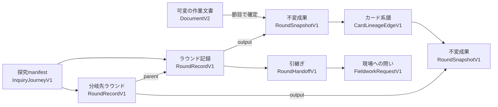

# 反復的探究のデータモデル

- Status: 採択済み設計目標（未実装）
- Updated: 2026-07-15
- Decision: `01_Plans/adr/ADR-0057-w-type-cumulative-inquiry-model.md`
- Requirements: `00_Prompt/w_type_iterative_inquiry_requirements.md`
- Implementation: `01_Plans/issues/issue-DOMAIN-W-ITERATION-01-w-type-cumulative-inquiry-support.md`

## 1. この文書の位置づけ

この文書は、W型累積KJ法を支援するデータ境界の**採択済み設計目標**を定める。現時点の `DocumentV2`、API、保存形式へ、この型が実装済みであることを示す文書ではない。実装・移行・運用CRUDが揃うまでは、すべて `L0: Planned` として扱う。

設計の要点は次のとおりである。

1. 日常編集する `DocumentV2` と、長期探究の履歴を分離する。
2. 操作を一件ずつ記録するのではなく、人が意味を確認した節目の成果を不変スナップショットとして残す。
3. 前段階への戻り、同段階の再試行、複数案の展開を、過去成果の上書きではなく有向非巡回グラフ（DAG）の分岐として表す。
4. ローカル保存とファイル交換を中核に置き、サーバーだけに存在する参照を必須にしない。

## 2. 比較した方式

評価は、KJ法への忠実性、停止・再開、可搬性、後方互換、安全共有、性能、将来の共同作業、実装・運用負荷の8観点で行った。

| 方式 | 強み | 主な問題 | 判断 |
|---|---|---|---|
| `DocumentV2` へ履歴を埋め込む | 一ファイルで扱いやすい | 文書が肥大化し、現行validator、共有、削除、SafeModeへ影響が波及する | 不採用 |
| ラウンドごとに文書を複製する | 現行保存を流用できる | 系譜・分岐・再開がファイル名と人手管理に依存する | 不採用 |
| 操作単位のイベントソーシング | 詳細な監査と再生が可能 | イベント進化、再生、削除、投影、競合解決の負担が現段階では過大 | 不採用 |
| 独立manifestから可変文書を参照する | 現行文書と履歴を分離できる | 参照先の編集や削除で過去成果が変化・欠落する | 単独では不採用 |
| 独立探究 + 不変スナップショットDAG + 自己完結bundle | 意味のある履歴、分岐、可搬性、現行契約の分離を両立できる | 新しい検証、容量管理、共有範囲UIが必要 | **採用** |

イベントソーシングは将来も全面採用を既定としない。共同編集や監査で操作意図の履歴が必要になった場合に限り、対象を限定して別ADRで再評価する。

## 3. 論理構造

### 3.1 `InquiryJourneyV1`

探究全体のmanifestであり、少なくとも次を持つ。

- `journeyId`: 探究の安定ID。
- `title`: 利用者が識別する題名。
- `roundRecords`: ラウンド記録の集合。
- `headRoundIds`: 現在先端にある分岐の集合。
- `defaultHeadRoundId?`: 開いたときに提示する既定分岐。唯一の正解を意味しない。
- `createdAt` / `updatedAt`: manifestの管理時刻。

単一の `activeRoundId` を探究全体の真実にしない。複数分岐を同時に保持でき、現在表示中のラウンドはview stateとして別に扱う。

### 3.2 `RoundRecordV1`

- `roundId`: ラウンド記録の安定ID。
- `stage`: `r1_problem_setting` から `r6_procedure_planning` までの段階。
- `iteration`: 同じ段階を実施した回数。段階番号とは独立する。
- `parentRoundIds`: 派生元ラウンド。通常は1件、将来の人手統合では複数を許容する。
- `status`: `working | paused | handed_off | superseded`。`completed` は品質保証と誤解されるため使わない。
- `theme`: このラウンドで向き合う問い。
- `inputSnapshotIds`: 参照した過去成果。
- `outputSnapshotId?`: 人が節目を確認した成果。
- `handoff?`: 次に持ち越す内容と未解決点。

`parentRoundIds` は循環してはならない。段階番号が小さくなる親子関係も許容し、それを差し戻しではなく分岐として表示する。

### 3.3 `RoundSnapshotV1`

人が「ここまでを残す」と確認した意味のある中間成果である。

- `snapshotId`: 内容から独立したランダムID。
- `schemaVersion`: スナップショット契約のversion gate。
- `createdAt`: 確定時刻。
- `document`: その時点を再現できる `DocumentV2` payload。
- `canonicalDigest`: 正準化後の内容に対する整合性確認値。

スナップショットは作成後に変更しない。訂正は新しいラウンド成果、または訂正理由を持つ派生成果として残す。`canonicalDigest` は同一内容の検出と破損確認に使うもので、秘匿、認可、真正性を保証しない。正準化方式は実装前にfixtureで固定し、候補としてRFC 8785 JCSを検証する。

スナップショット内のカード本文は、その節目における読取専用の歴史値であり、現在編集するカード正本ではない。同じ成果を複数ラウンドから使うだけなら同じ `snapshotId + cardId` を参照する。過去成果から分岐するときだけ、スナップショットを新しい可変作業文書の出発点として展開し、確定時に新しいスナップショットと系譜を作る。この違いにより、利用者が手動で文書を複製する方式とは区別する。

選択状態、開閉中のパネル、hover、現在表示中のtabは含めない。カード、配置、島、関係、文章化、保留、違和感、根拠など、思考を再現する意味状態は含める。

### 3.4 `RoundHandoffV1`

- `carryoverRefs`: 次へ持ち越すカード、島、仮説、方針。
- `heldRefs`: 保留または対象外として残すもの。
- `unresolvedQuestions`: 未解決の問いと矛盾。
- `fieldworkRequests`: 追加観察、取材、資料確認、実験の問い。
- `understandingDelta`: 問いまたは理解がどう変化したか。

担当者、期限、承認状態を必須にしない。正式な組織承認を導入する場合は、思考上の引継ぎと別の契約・権限境界として扱う。

### 3.5 `CardLineageEdgeV1`

スナップショットを越えて情報の由来を辿るため、`fromSnapshotId + fromCardId` と `toSnapshotId + toCardId` を接続する。種類は少なくとも次を持つ。

- `carried`: 本文上の同一性を保って持ち越した。
- `edited`: 元情報を参照しつつ表現または解釈を変更した。
- `split`: 一枚を複数の中心的内容へ分けた。
- `merged`: 複数の情報を統合した。
- `new`: 追加観察などから新しく生じた。
- `retired`: 次へ持ち越さず元成果に残した。

安定したカードIDが同じなら `carried` を導出できる。`split`、`merged`、意味を変える `edited` は、人が確認した明示的系譜として保存する。後段階の解釈を前段階の観察本文へ上書きしない。

## 4. 保存と交換

### 4.1 アプリ内保存

論理的には次を別集約として扱う。

1. `DocumentV2`: 現在の可変作業文書。
2. `InquiryJourneyV1`: ラウンドDAG、引継ぎ、系譜を持つmanifest。
3. `RoundSnapshotV1`: 内容不変の成果blob。

初期実装では、JSON集約またはblobとして保存してよく、カードや島を直ちに個別テーブルへ正規化しない。物理DB、API、削除・保持ポリシーは、roundtripと容量計測後に決める。

### 4.2 export bundle

共有・移行用成果物は、manifestだけを出力しない。選択したラウンドまたは分岐に必要な次の要素を一つの自己完結bundleへ含める。

- `InquiryJourneyV1` の対象範囲。
- 参照されるすべての `RoundSnapshotV1`。
- 対象範囲の `RoundHandoffV1`、`FieldworkRequestV1`、`CardLineageEdgeV1`。
- schema version、各成果のdigest、共有範囲とSafeMode結果。

importは参照がbundle内で閉じていること、digestが一致すること、親グラフに循環がないこと、未知キー・未知versionをfail-closedで拒否できることを検証する。

SafeModeによるマスクは元スナップショットを変更しない。共有用の派生bundleを作り、マスク後の内容に新しいdigestを付ける。元bundleのdigestやIDを秘匿性の代用にしない。

### 4.3 削除と保持

不変性は通常編集に対する規則であり、個人情報・機密情報の削除、保持期限、利用者の削除要求より優先しない。

- 探究全体の削除を、最初に保証する最小の完全削除単位とする。
- 子孫を持つラウンドまたは成果だけを削除する場合は、依存する分岐をまとめて削除するか、機微情報を除いた置換探究を作って参照を閉じた状態で検証した後に元探究を削除する。参照切れのまま保存しない。
- 削除後に残す監査情報は、削除日時、対象種別、実行結果など本文を含まない最小メタデータに限定する。主体情報の扱いは認証・監査ポリシーへ従う。
- 保持上限、分岐削除UI、置換手順はPhase 2のfixtureで検証し、標準運用がない間は探究を `L1` へ昇格しない。

## 5. UI境界

- 通常モードへ6段階、進捗率、履歴パネルを追加しない。
- 高度機能を有効にしたときだけ「現状把握・2回目」のような現在位置を一行で示す。
- 全体は直線progress barではなく、要求時に開く分岐図で示す。
- 節目の確認は、持ち越し、保留、未解決点、現場への問いを一件ずつ扱う。
- 過去成果を開いた状態では読取専用を明示し、編集開始は「この成果から分岐」とする。
- 再開ブリーフは導出表示とし、各項目から元カード・成果へ移動できる。
- マウス、キーボード、390px幅で同じ意味の操作を完了できることを実装ゲートにする。

## 6. 不変条件

1. 過去の `RoundSnapshotV1` を後続編集で変更しない。
2. R1からR6の順序や回数を品質点数にしない。
3. ラウンド段階をカード固有属性、権限、事実確認、レビュー済みの根拠にしない。
4. AI提案は人が採用するまでmanifest、成果、系譜、レビュー状態を変更しない。
5. `KJ_ATLAS_LLM_PROVIDER=none` で作成、引継ぎ、停止・再開、分岐、比較が成立する。
6. bundleの参照は内部で閉じ、外部サーバーがなくても検証・閲覧できる。
7. 個人情報・未レビュー本文の削除またはマスクを、不変性を理由に妨げない。共有物は派生bundleとして作り直す。

## 7. 段階的導入

| Phase | 内容 | 永続化 |
|---|---|---|
| 0 | 型、fixture、不変条件、分岐検証 | なし。メモリ内のみ |
| 1 | 高度機能内の低忠実度UI、初期表示差分0の確認 | なし |
| 2 | 独立集約と自己完結bundleのroundtrip、strict import、容量計測 | ローカル成果物 |
| 3 | backend保存/API、保持・削除、障害復旧 | 実装判断後 |
| 4 | proposal-only AI支援 | 中核操作とは分離 |
| 5 | 実需が確認された場合だけ共同編集方式を再検討 | 別ADR |

Phase 0・1で操作模型が理解されない場合は永続契約へ進まない。Phase 2で代表規模の容量・読込時間が性能予算を満たさない場合は、スナップショット圧縮または差分格納を内部最適化として比較する。ただし、外部契約は完全な成果を再構成できることを維持する。

## 8. 根拠と関連文書

- [川喜田研究所「KJ法とは」](https://kj-kawakita.co.jp/about_kj-method/)
- [日本創造学会「W型問題解決学」](https://keyword.japancreativity.jp/applied/w%E5%9E%8B%E5%95%8F%E9%A1%8C%E8%A7%A3%E6%B1%BA%E5%AD%A6-%E5%9C%8B%E8%97%A4%E9%80%B2/)
- [Microsoft Azure Architecture Center: Event Sourcing pattern](https://learn.microsoft.com/en-us/azure/architecture/patterns/event-sourcing)
- [Git Book: Git Objects](https://git-scm.com/book/en/v2/Git-Internals-Git-Objects)
- [W3C PROV-O](https://www.w3.org/TR/prov-o/)
- [RFC 8785: JSON Canonicalization Scheme](https://www.rfc-editor.org/rfc/rfc8785.html)
- [Ink & Switch: Local-first software](https://www.inkandswitch.com/essay/local-first/)
- `02_Architecture/schemas.md`
- `02_Architecture/data_model_operations_overview.md`
