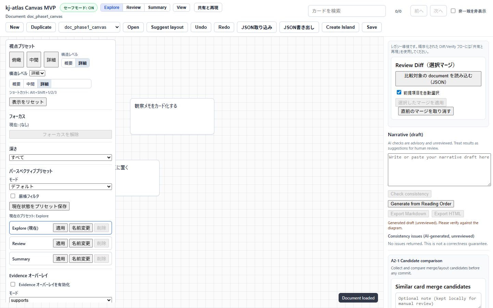

# E2E Testing

対象読者: kj-atlas の実装変更に対して Playwright E2E、回帰テスト、PR 前確認を行う開発者、QA、メンテナ。

目的: Docker Compose またはローカル起動環境で、開発者向け E2E を再現できるようにします。一般利用者向けの画面確認は [受け入れ確認](../../../04_Documentation/acceptance_check.md) を参照してください。

範囲外: 組織固有のテスト管理、非公開データを使った検証、CI 基盤の詳細設定、一般利用者向けの導入説明。

## 事前準備

標準構成を起動します。

```bash
cd 03_Implement/deploy
docker compose up --build -d
curl -fsS http://localhost:8080/api/healthz
curl -fsS http://localhost:8080/api/docs/doc_phase1_canvas
```

ローカル開発サーバーで確認する場合は [導入手順](../../../04_Documentation/installation.md) の「Docker を使わない最小起動」を使います。Vite の `/api` proxy は backend が起動していないと 500 を返すため、E2E 前に次の両方を確認します。frontend の port を変更した場合は `4173` を実際の port に置き換えてください。

```bash
curl -fsS http://127.0.0.1:8000/healthz
curl -fsS http://127.0.0.1:8000/docs/doc_phase1_canvas
curl -fsS http://127.0.0.1:4173/api/docs/doc_phase1_canvas
```

## 手動確認と自動テストの違い

| 種類 | 目的 | 使う場面 |
| --- | --- | --- |
| 手動 smoke test | 利用者の主要操作が実際にできるかを見る | 初回起動、画面変更、障害調査 |
| Playwright E2E | ブラウザ操作を自動で再現する | PR、リリース前、回帰確認 |
| unit/regression test | 小さなロジックやデータ変換を速く確認する | 実装変更後、原因切り分け |

一般利用者の確認では、まず [受け入れ確認](../../../04_Documentation/acceptance_check.md) の手動 smoke test だけで十分です。開発変更を含む場合は自動テストも実行します。

## 手動 smoke test

1. `http://localhost:8080` を開く。
2. 新規ドキュメントを作成する。
3. カードを追加する。
4. カードを移動する。
5. 島またはレビュー関連の表示が崩れていないことを確認する。
6. 保存し、ページを再読み込みする。
7. 変更が残っていることを確認する。
8. share/export を使う場合、[データ取り扱い](../../../04_Documentation/data_handling.md) のチェックリストに沿って、出力に秘密情報や内部メモが混ざっていないことを確認する。

表示設定や SafeMode の確認を含める場合は、`View` パネルを開きます。手動 smoke test では、視点プリセット、深さ、SafeMode、export legacy 導線が表示され、キャンバスが操作不能になっていないことを確認します。



## Playwright を実行する

frontend の依存関係を入れます。

```bash
cd 03_Implement/frontend
npm ci
```

`npm ci` は `package-lock.json` に固定された依存関係を入れるため、E2E の再現性を保ちやすい手順です。

E2E を実行します。

```bash
npm run e2e
```

画面を見ながら確認する場合:

```bash
npm run e2e:headed
```

特定の mock E2E だけ実行する場合:

```bash
npm run e2e:mock
```

## 単体・回帰テスト

E2E の前に軽量な回帰確認を行う場合:

```bash
cd 03_Implement/frontend
npm run typecheck
npm run test
npm run test:regression-guards
```

### 代表ユーザ操作の回帰レーン

`npm run test:regression-guards` には `src/ui/ux_operability_regression.test.ts` を含めます。このテストは、マウス操作とキーボード操作が同じ選択結果へつながること、カード選択後に文脈パネルへ進めること、`表示` / `共有と再現` パネルを `Escape` で閉じて起点へ戻れることを、実装上の契約として固定します。

このレーンは Playwright の代替ではありません。狙いは、E2E 実行前に主要操作の入口が壊れていないことを短時間で確認し、`PRODUCT-QA-01` の G2 主要操作ゲートへ渡す一次証跡を作ることです。リリース候補では、次の順で証跡を積み上げます。

Windows のローカルシェルで `npm` が PATH にない場合は、同梱 Node.js など、プロジェクトで承認された Node.js 実行ファイルから `node .\node_modules\vitest\vitest.mjs run <対象テスト>` を実行して同じ対象を確認します。CI と通常の開発環境では `npm run test:regression-guards` を正準コマンドとして扱います。

| 段階 | 代表操作 | 証跡 |
| --- | --- | --- |
| 契約テスト | pointer 選択、`Enter` / `Space` 選択、`Escape` 閉鎖、フォーカス復帰 | `npm run test:regression-guards` |
| 手動 smoke | 初期表示、カード作成、移動、保存、再読込、共有前確認 | 手順メモ、必要に応じてスクリーンショット |
| Playwright E2E | 作成→編集→保存→再読込、共有試行→条件充足→許可 | `npm run e2e` または `npm run e2e:mock` |

キーボードでは、`Tab` で対象へ移動し、`Enter` または `Space` で選択、`Escape` で一時パネルを閉じます。マウスでは、対象をクリックまたはドラッグした後、同じ詳細表示・保存・共有前確認へ進めることを確認します。どちらか一方だけで成立する操作は、G2 では未達として扱います。

backend:

```bash
cd 03_Implement/backend
python -m pytest
```

## 確認観点

| 観点 | 期待 |
| --- | --- |
| 起動 | `/api/healthz` が成功する |
| 標準サンプル | `doc_phase1_canvas` が backend 直アクセスと frontend proxy の両方で成功する |
| 保存 | 作成・編集した内容が再読み込み後も残る |
| SafeMode | 未レビュー情報を AI が自動確定しない |
| LLM disabled | `KJ_ATLAS_LLM_PROVIDER=none` では AI 機能が disabled として扱われる |
| export | 秘密情報や共有不要な調査メモが混ざらない |
| 画面 | ヘッダー、ツールバー、主要ボタンが狭い幅でも重ならない |
| 操作性・開始 | 初期表示で主要操作へ到達できる |
| 操作性・選択 | キーボードで選択対象へ到達し、選択結果を確認できる |
| 操作性・表示 | 文脈優先で必要情報が先に提示される |
| 操作性・閉じる | `表示` / `共有と再現` を `Escape` で閉じられる |
| 操作性・復帰 | 閉じた後に起点フォーカスへ戻る |

## viewport の目安

画面崩れを確認するときは、少なくとも次の幅を見ます。

| 幅 | 目的 |
| --- | --- |
| 1280px | 標準的な desktop |
| 960px | 狭めの desktop / tablet |
| 390px | mobile 相当 |

すべての細部を確認する必要はありません。主要操作が見えるか、テキストが重ならないか、保存操作ができるかを優先します。

390px では、ヘッダーが複数行に折り返され、検索、表示モード、共有と再現、保存などの主要操作が画面外へ消えないことを確認します。


## QA Monkey / E2E 境界（テスト資産限定）

本節は **テスト資産のみ** を変更対象にする境界定義です。`src/ui` / `src/canvas` など本番実装コードの機能変更は含めません。

### レイヤ分離（契約テスト / スモーク / E2E）

| レイヤ | 目的 | 変更対象 | 禁止事項 |
| --- | --- | --- | --- |
| 契約テスト (unit/integration) | API・ドメイン契約の不整合を早期検知 | `03_Implement/frontend/tests/**/*` fixture / test | UI機能追加・仕様変更 |
| スモーク (manual/lightweight) | 起動・主要導線・安全境界の即時確認 | 手動手順・記録テンプレート | 合否を翻訳品質だけで確定 |
| E2E (Playwright) | 実利用シナリオと境界回帰の自動再現 | Playwright spec / mock fixture / docs | 本番データ依存・不安定な外部依存 |

### QA Monkey 群の優先境界

1. SafeMode / share-export は fail-closed を維持する。
2. `KJ_ATLAS_LLM_PROVIDER=none` でも回帰検証が継続可能である。
3. `ja/en` のユーザージャーニー等価は E2E で機械判定し、翻訳品質は人間レビューに分離する。

### 再現性・flaky対策（必須）

- mock/fixture を優先し、外部依存を固定する。
- 同一 commit で `npm run test` → `npm run e2e:mock` を同順で実行し、差分再現を確認する。
- flaky が発生した場合は、まず再実行または待機調整で切り分ける。同一原因で繰り返し失敗する場合は無条件の再実行で握り潰さず、fixture または実装側の問題として対象 issue へ記録する。


## QA issue の Open化条件

`issue-QA-*` を Draft から Open へ進める AC/DoD、証跡フォーマット、Gate テンプレートは、対象 issue memo と [issues/README.md](../../../01_Plans/issues/README.md)（Lifecycle運用）、`01_Plans/adr/ADR-0019-e2e-verification-policy-and-compose-runbook.md` を正本とします。値や進行テンプレートを本書へ複製せず、対象 issue を直接参照してください。

## 失敗時に残す情報

- 実行したコマンド
- 対象 URL
- ブラウザと viewport
- 失敗した操作
- API status code
- `docker compose logs api --tail=200`
- 可能ならスクリーンショット

ログやスクリーンショットを共有するときは、API key、token、password、未加工の顧客情報を含めません。どこまで残すか迷う場合は [データ取り扱い](../../../04_Documentation/data_handling.md) を参照してください。

## E2E 記録

検証結果を残すときは内部の検証記録テンプレートを使います。個人情報、秘密情報、内部承認履歴は記録しません。

### 実行経路とPR証跡

標準経路はDocker Composeです。Dockerを実行できない場合だけSQLite + frontend dev serverまたはmock fixtureを使い、Composeとの差分リスクをPRへ残します。詳細な優先順位と例外条件は `01_Plans/adr/ADR-0019-e2e-verification-policy-and-compose-runbook.md` を参照してください。

```md
### E2E verification
- Path: Compose | SQLite | mock
- Command:
- Result: pass | fail | blocked | not executed
- Evidence:
- Not executed reason:
- Unverified risk delta:
- Resume condition / owner:
```

代替経路で未確認になる代表境界:

| Risk ID | Composeで確認する境界 | 代替経路での扱い |
| --- | --- | --- |
| R-01 | PostgreSQL方言、migration、接続pool | 未確認として記録し、Composeでroundtripを再実行する |
| R-02 | web経由の`/api` rewrite、CORS、圧縮 | frontend直結だけで合格にしない |
| R-03 | db healthy → api → webの起動連鎖 | `docker compose ps`とapi logを後日確認する |
| R-04 | Compose network上のweb↔api↔db接続 | mock成功をintegration成功と表現しない |

### 認証連携を変更した場合

認証header/JWT mapping、provider preset、logout、step-up、JIT provisioning境界を変更した場合は、通常のfrontend E2Eだけで完了にしません。`01_Plans/adr/ADR-0020-oidc-saml-mock-idp-sp-profile.md` とbackendの `scripts/run_auth_level2.sh` に従い、provider profile fixtureを使ったLevel 2を実行します。

### fixture-backed visibility suiteの境界

`e2e/pub_visibility_i18n_readonly_flow.spec.ts` は、document、public-pack index、provider statusをPlaywright routeで固定するfrontend fixture suiteです。各シナリオはbackendプロセスなしで動作するよう、決定論的な応答をrouteで供給します。

このsuiteが検証するのはブラウザ内のvisibility挙動とreload後の表示状態であり、backend永続化やprovider integrationを検証したとはみなしません。それらの契約はbackend testと、明示的に構成したintegration実行に属します。

| シナリオ | 境界 |
| --- | --- |
| reload後のvisibility | fixture固定UI + ブラウザstorage |
| viewとpackで異なるvisibility説明 | fixture固定UI |
| 英語切り替えフロー | fixture固定UI |
| readOnly / SafeMode制限 | fixture固定UI |

この境界を確認するコマンド:

```bash
cd 03_Implement/frontend
node ./node_modules/@playwright/test/cli.js test e2e/pub_visibility_i18n_readonly_flow.spec.ts --reporter=line
```

### 実backend必須suiteの境界（AI-MODEL-UX-01）

`e2e/ai_model_ux_available_models_reason.spec.ts` は、`GET /ai/available-models` の `unavailableReason`（`no_active_models` / `provider_unavailable` / `tenant_policy_excludes_all`）が実backendのmodel registry・provider・tenant allowlist状態から実際に導かれ、ModelSelectorの案内文言へ正しく反映されることを固定するsuiteです。他のe2e specとは逆に、page.routeでは固定せず、`/admin/provision/models/**` 管理APIで実registryを変更し、reloadで再取得させます。

`KJ_ATLAS_E2E_REAL_BACKEND=1` を設定しない限り全ケースskipするため、`npm run e2e` / `npm run e2e:mock` の既定実行は本suiteの影響を受けません。実行するには、SQLite代替E2Eの手順（本書冒頭）でbackendを起動したうえで:

```bash
cd 03_Implement/backend
PYTHONPATH=src KJ_ATLAS_DATABASE_URL="sqlite:////tmp/kj_atlas_model_ux_e2e.sqlite3" python -m alembic upgrade head
PYTHONPATH=src KJ_ATLAS_DATABASE_URL="sqlite:////tmp/kj_atlas_model_ux_e2e.sqlite3" KJ_ATLAS_LLM_PROVIDER=none \
  python -m uvicorn kj_atlas_api.main:app --host 127.0.0.1 --port 8000

cd 03_Implement/frontend
KJ_ATLAS_E2E_REAL_BACKEND=1 node ./node_modules/@playwright/test/cli.js test \
  e2e/ai_model_ux_available_models_reason.spec.ts --reporter=line --workers=1
```

`no_active_models` のケースは空のmodel registryを前提とするため、backendは毎回フレッシュなSQLiteファイルで起動してください（前回実行のfixture登録が残っていると誤ってfailします）。ローカル-devプロファインは無設定で管理面が開いているため、`KJ_ATLAS_API_KEY` / `KJ_ATLAS_ADMIN_API_KEY` は不要です。第4のreason（`no_user_selectable_models`）はissue memoの受入条件が明示する3件（provider不一致・allowlist空・active modelなし）に含まれないため、本suiteでは対象外です。

## 関連文書

- [導入手順](../../../04_Documentation/installation.md)
- [受け入れ確認](../../../04_Documentation/acceptance_check.md)
- [運用手順](../../../04_Documentation/operations.md)
- [診断と障害調査](../../../04_Documentation/diagnostics.md)
- [データ取り扱い](../../../04_Documentation/data_handling.md)
- [セキュリティ](../../../04_Documentation/security.md)

## Release Gate 連携（QA専任運用）

- E2E結果は `PRODUCT-QA-01` の Gate Record に `result/evidence/owner/due` 形式で転記します。
- Blocker または Critical を検出した場合は、E2E段で即時停止し `MVP-EXIT-01` 判定を Fail にします。
- Compose実行不可時は `ADR-0019` の代替経路（SQLiteまたはmock）を使用し、未実施理由を必ず記録します。
