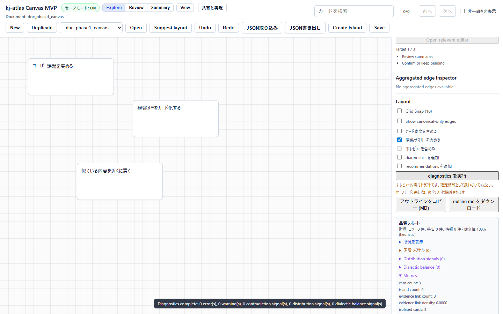

# Diagnostics

対象読者: 画面表示、保存、AI 提案、worker 処理の問題を調査する開発者、QA、運用担当者。

目的: 障害時に最初に見る場所、切り分け順、記録すべき情報をまとめます。

範囲外: 非公開の監視基盤、個別インシデントの詳細ログ、秘密情報を含む調査記録。

公開区分: 利用者/一次対応者向け公開候補。安全に共有できる再現情報、画面症状、非機微ログの切り分けに限定し、内部監査ログや秘密情報の本文共有は求めません。

読後にできること: 画面、API、DB、外部接続のどこで問題が起きているかを切り分け、共有に必要な情報を安全に記録できます。

## 最初に確認すること

1. どの URL で発生したか。
2. どの操作で発生したか。
3. 直前に保存、import、export、AI 提案、レビュー操作を行ったか。
4. API は応答しているか。
5. ブラウザ console と network にエラーがあるか。

## 調査の考え方

障害調査では、まず「画面だけの問題か」「API も失敗しているか」「DB まで影響しているか」を分けます。原因を一度に決めつけず、利用者に見えている症状から奥へ進みます。

最初の5分では、原因の断定よりも再現条件の確認を優先してください。発生 URL、操作手順、API status、console error がそろうだけで、後続の調査がかなり楽になります。

| 層 | 見るもの |
| --- | --- |
| 画面 | ブラウザ console、表示崩れ、操作不能 |
| API | HTTP status、`/healthz`、backend logs |
| DB | `db` health、migration、保存結果 |
| 外部接続 | LLM provider、監査ログ連携の接続先、access control の接続先（endpoint） |

## 前提知識

この文書の調査では、次の3つを区別できれば十分です。

| 用語 | 意味 |
| --- | --- |
| frontend | ブラウザで動く画面側です。 |
| backend/API | 保存、AI 提案、認証などを処理するサーバー側です。 |
| DB | ドキュメントや操作結果を保存するデータベースです。 |

## ヘルスチェック

Docker Compose:

```bash
curl -fsS http://localhost:8080/api/healthz
docker compose ps
docker compose logs api --tail=200
```

直接起動:

```bash
curl -fsS http://127.0.0.1:8000/healthz
```

## ブラウザで見る場所

- Console: JavaScript error、worker error、failed fetch。
- Network: `/api/docs/<doc_id>`、`/api/ai/*`、status code。
- Application/Storage: local storage や cache が古い状態を保持していないか。

画面内の diagnostics は、右側パネルの layout/outline 周辺から実行できます。実行後は品質レポート、所見件数、メトリクスが表示されるため、障害調査メモにはこの結果と API status を合わせて残します。



## よくある切り分け

| 症状 | 主な確認 |
| --- | --- |
| 画面が真っ白 | frontend build、console error、nginx logs |
| `Internal Server Error` が表示される | backend が起動しているか、`/api/healthz` が成功するか。標準サンプル `doc_phase1_canvas` は初回ブラウザ表示時に作成されるため、初回表示前の `/api/docs/doc_phase1_canvas` は 404 が正常（5xx の場合のみ backend を調査） |
| 保存に失敗 | API status、`X-API-Key`、backend logs、DB 接続 |
| `password authentication failed for user "kj_atlas"` が backend logs に出る | まず `env \| grep -i kj_atlas`（export 済み変数が compose を上書きし `down -v` でも直らない）と `docker compose config`（db 側パスワードと `KJ_ATLAS_DATABASE_URL` 内パスワードの一致）。次に古い `kj_atlas_pgdata` volume の残存（`pg_isready` は認証未検証のため db は healthy に見える）。詳細と復旧手順は installation.md の同名項目を参照 |
| AI 提案が出ない | `KJ_ATLAS_LLM_PROVIDER`、provider endpoint、SafeMode |
| 書き出しが失敗、または長時間終わらない | 対象ドキュメントの schema、画面上の進捗・中止メッセージ、ブラウザ console |
| worker が落ちる | 入力データ、worker console、該当 worker の単体テスト |

## worker 関連の確認

worker 由来の問題が疑われる場合は、まず入力データの大きさ、schema、review 状態を確認します。

診断やレビューパックの書き出しが長く続く場合は、処理名、進捗表示、キャンセルできたか、キャンセル後の画面メッセージを記録します。キャンセルで復帰できる場合は、まず入力データの大きさや対象範囲を小さくして再試行してください。キャンセルしても画面が復帰しない場合は、worker error として扱います。

レビュー差分の計算が長く続く場合も同じです。比較対象ドキュメントの読み込み後に「差分を計算中」と表示されるか、キャンセル後に「差分計算を中止しました」と表示されるかを記録します。差分計算は比較対象のサイズや関係線の数に影響されるため、再試行時は小さい比較ファイルで再現するか確認してください。

## 大きな文書・低速環境の確認

大きな文書や低速環境では、処理時間そのものよりも、利用者が次の判断をできる表示になっているかを確認します。

| 確認対象 | 見ること | 記録すること |
| --- | --- | --- |
| 検索 | 検索語を入力しても画面が固まって見えないか | 検索語、カード数、結果が表示されるまでの体感 |
| 表示切替 | `表示` パネルが viewport からはみ出さないか | viewport、開いたパネル、見切れの有無 |
| 共有前確認 | `共有と再現` で SafeMode、公開範囲、出力形式が読めるか | SafeMode状態、公開範囲、実行前に読めた警告 |
| 診断 | 実行中ボタンが無効になり、キャンセルできるか | 進捗表示、キャンセル後のメッセージ |
| レビューパック書き出し | 処理中表示とキャンセルが同じ画面内で分かるか | 出力粒度、キャンセル可否、成功/中止結果 |
| 差分確認 | 比較対象の読み込み後、差分計算中と中止結果が分かるか | 比較ファイルの大きさ、キャンセル操作、結果メッセージ |

狭い画面で再現した場合は、`390px`、`768px`、`960px`、`1440px` のどの幅で確認したかを残してください。画面外にはみ出した情報が SafeMode、共有前確認、キャンセル操作の場合は、軽微な崩れではなく共有・復帰判断に関わる問題として扱います。

```bash
cd 03_Implement/frontend
npm run test
npm run typecheck
```

特定の worker test がある場合は、そのファイルだけを指定して実行します。

```bash
npm run test -- src/worker/<test-file>.test.ts
```

## 記録する情報

- 発生日時
- commit
- URL
- ブラウザと viewport
- 操作手順
- 期待結果
- 実際の結果
- API status code
- console error
- 再現率

秘密情報、API key、token、生の顧客データは記録しません。どの情報を残せるか迷う場合は [data_handling.md](data_handling.md) を確認してください。

## 共有用テンプレート

```text
発生日時:
環境:
URL:
ブラウザ:
操作手順:
期待した結果:
実際の結果:
API status:
再現率:
添付できるログ:
秘密情報の除去確認: 済 / 未
```

## サポート診断バンドル（PRODUCT-OPS-02 / ADR-0053）

上のテンプレートを手入力する代わりに、画面ヘッダーの「サポート診断バンドル」から、共有してよい情報だけをその場で組み立てられます。

- 障害分類（下表の5コードのいずれか。必須）を選び、任意で直近の HTTP status を入力し、「診断バンドルを生成」を押します。
- 生成後は必ず全文プレビューが表示されます。コピーまたはダウンロード（`diag-bundle.v1` 形式の JSON）は、内容を確認したあとにのみ行えます。
- 自動送信は一切行いません。生成・プレビュー・コピー・ダウンロードはすべてローカルの操作です。
- 含まれるのは、アプリ revision（検証できない場合は `unknown`）、正規化済みブラウザ family/major・OS family、選択した障害分類・任意の HTTP status、SafeMode 状態、provider 種別、対象文書の version/updatedAt とカード/島/エッジの**件数のみ**です。
- カード・島・narrative 等の本文、文書 ID、entity id/ref、API key/token/password、内部URL、個人情報、生の UserAgent、error message/stack は SafeMode の ON/OFF に関わらず一切含まれません。許可リストの詳細は [ADR-0053](https://github.com/hat47x/kj-atlas/blob/main/01_Plans/adr/ADR-0053-support-diagnostics-bundle-boundary.md) を参照してください。
- パネルを閉じる（Escape・×・キャンセル）と、生成済みの内容はメモリから破棄されます。

## 障害分類と一次切り分け

5分以内の一次切り分けは、次の分類コードで記録します。

| 分類コード | 判断条件 | 最初の確認コマンド/操作 |
| --- | --- | --- |
| WEB-ENTRY | 画面表示異常が主症状 | ブラウザ Console / `docker compose logs web --tail=100` |
| API-UNAVAILABLE | API応答失敗、502/503 | `curl -fsS http://localhost:8080/api/healthz` / `docker compose logs api --tail=200` |
| SAVE-FAILURE | 保存失敗、再読み込み不一致 | Network status、`docker compose logs db --tail=100` |
| IMPORT-VALIDATION | import時のschema/検証失敗 | importエラーダイアログ、schemaVersion、validation内容 |
| SHARE-SAFEMODE | share/export 前警告、マスク警告 | 共有と再現パネルで SafeMode / visibility 確認 |

## 復旧責務の分離

- First Responder: 分類、再現手順、非機微ログの採取までを担当。
- System Owner: 外部共有可否と復旧優先度を承認。
- Platform Operator: 再起動/設定反映/ロールバックの実行を担当。

停止条件（Stopper）:

- 役割衝突（承認者と実行者が同一で分離できない）。
- 承認責務が不明（誰が SafeMode 緩和や外部共有可否を決めるか未定）。
- secrets 除去前の生ログ共有を要求される。

上記が1つでも該当する場合、復旧作業を先に進めず `operations.md` のエスカレーション導線へ切り替えます。


### Plan → Execute → Verify（診断フロー）

診断は「原因推定」より先に、次の3段階を固定します。

- **Plan**: 分類コードを1つ選び、成功判定（AC）を「再現条件が言語化できる」「安全に共有できる」「復旧判断へ渡せる」の3点で置く。
- **Execute**: 5分以内の一次切り分けを実行し、コマンド結果・画面症状・SafeMode状態を記録する。
- **Verify**: `operations.md` 側の復旧担当へ引き渡せる粒度（症状、再現率、非機微ログ、未解決点）になっているか確認する。

完了条件が足りず検証完了を判定できない場合は、調査を「完了」とせず、[operations.md](operations.md) の暫定対応メモとして不足点を記録して引き継ぎます。

## 手順再現性チェック

調査完了時に次の3点を必ず残します。

1. 同じ症状を再現できる最小手順（3〜7ステップ）。
2. 実行コマンドと結果（成功/失敗）。
3. 再試行時に必要な前提（環境変数、SafeMode状態、対象ドキュメント）。

## 復旧の基本

1. 変更直後なら、直前の設定差分を確認します。
2. DB 接続や migration エラーなら backend logs を確認します。
3. frontend の表示だけ壊れている場合は cache を無効化して再読み込みします。
4. LLM や audit HTTP 連携が関係する場合は、一度 `KJ_ATLAS_LLM_PROVIDER=none`、`KJ_ATLAS_AUDIT_EXPORT_ENABLED=false` に戻して再確認します。

復旧を急ぐ場合でも、秘密情報を含むログをそのまま共有しないでください。共有前に API key、token、個人情報、生の顧客データを除去します。

## 関連文書

- [operations.md](operations.md)
- [configuration.md](configuration.md)
- [acceptance_check.md](acceptance_check.md)
- [data_handling.md](data_handling.md)
- [security.md](security.md)
