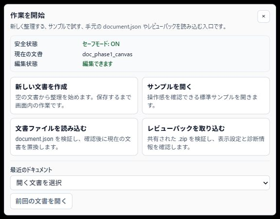
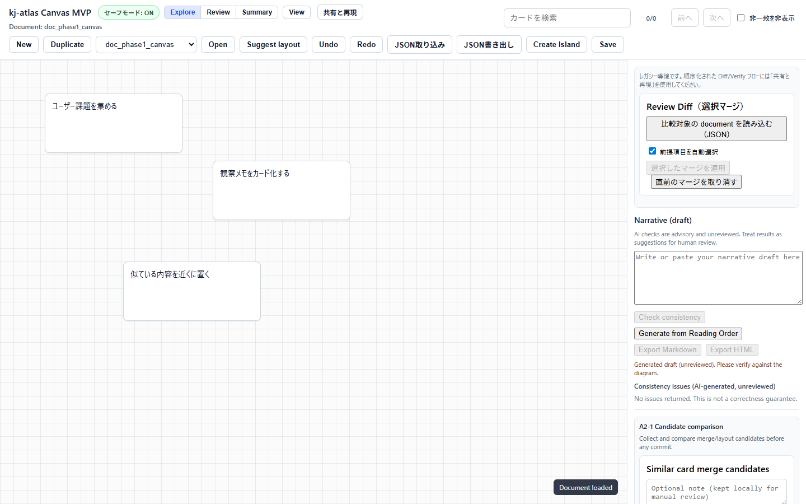

# Operations

対象読者: kj-atlas の日常運用、検証環境管理、リリース後確認を担当する人。

目的: 起動、停止、状態確認、更新、バックアップ、障害時の初動を再現できる手順としてまとめます。

範囲外: 組織固有の承認フロー、秘密情報管理、インフラ監視基盤の構築。

公開区分: 運用者向け公開候補。起動、停止、確認、バックアップ、共有前確認の運用境界を扱い、組織固有の承認履歴や内部計画は含めません。

## 標準構成

Docker Compose の標準構成は次の3サービスです。

| サービス | 役割 |
| --- | --- |
| `web` | React frontend と nginx proxy |
| `api` | FastAPI backend |
| `db` | PostgreSQL |

標準 URL は `http://localhost:8080` です。nginx は `/api/` を backend に転送します。

## 運用で見るもの

kj-atlas の運用確認は、次の順で見ると切り分けやすくなります。

1. 画面が開くか。
2. API が `/api/healthz` に応答するか。
3. DB が healthy か。
4. 保存と再読み込みができるか。
5. LLM や audit など、外部接続を有効にした部分だけ追加で確認する。

最初からすべてのログを読む必要はありません。利用者影響のある入口から順に確認します。

画面側の入口は次の状態を目安にします。起動直後に「作業を開始」パネルが表示され、新しい文書、サンプル、`document.json`、レビューパックの入口と SafeMode の状態を確認できれば、利用者は次の操作を選べます。



開始パネルを閉じるか入口を選ぶと、ヘッダーに SafeMode、表示モード、共有と再現、保存などの主要操作があり、キャンバスと右側パネルが表示されます。この状態まで進めば、次に API と保存の確認へ進めます。




## Runtime profile の選択

運用手順を開始する前に、対象環境の profile を固定します。
profile の詳細は GitHub 上の [runtime_parameter_registry.md](https://github.com/hat47x/kj-atlas/blob/main/02_Architecture/runtime_parameter_registry.md) を参照してください。ここでは運用時の判断だけを示します。

- 開発再現や不具合切り分け: `local-dev`
- Compose での評価・受入確認: `evaluation`
- 企業/行政の本番相当: `enterprise-production`

`enterprise-production` では次を起動前チェックに追加します。

- `KJ_ATLAS_ALLOW_JIT_PROVISIONING=false`
- `KJ_ATLAS_ACCESS_CONTROL_FAIL_SAFE_MODE=read_only` または `deny`
- 外部接続（LLM / audit / external_http）を有効化する場合、接続先・timeout・秘密管理の確認記録

## 起動

```bash
cd 03_Implement/deploy
docker compose up --build -d
```

## 状態確認

```bash
docker compose ps
curl -fsS http://localhost:8080/api/healthz
docker compose logs api --tail=100
```

確認すること:

- `db` が healthy になっている。
- `api` が migration 後に起動している。
- `web` が `KJ_ATLAS_WEB_PORT` のポートで公開されている。
- `/api/healthz` が `{"status":"ok"}` を返す。

`docker compose ps` はサービスの生死を見るコマンドです。`curl` は API の応答を見るコマンドです。どちらか片方だけでは原因を絞り切れないため、両方を確認します。

## 停止

```bash
cd 03_Implement/deploy
docker compose down
```

データも削除する場合だけ `-v` を付けます。

```bash
docker compose down -v
```

## 更新

1. 変更を取得します。

```bash
git pull --ff-only
```

2. 再ビルドして起動します。

```bash
cd 03_Implement/deploy
docker compose up --build -d
```

3. ヘルスチェックと主要操作を確認します。

```bash
curl -fsS http://localhost:8080/api/healthz
docker compose logs api --tail=100
```

## バックアップ

PostgreSQL volume を使っている場合、更新や検証前に dump を取得します。取得先、保管期間、暗号化、外部保管の有無は組織ごとに決める運用事項です。kj-atlas の手順では、まず検証環境で復元できることと、安全確認を再現できることを重視します。

```bash
cd 03_Implement/deploy
docker compose exec db pg_dump -Fc -U kj_atlas kj_atlas > kj_atlas_backup.dump
```

復元は既存データを上書きする可能性があります。まず本番DBではない検証用DBへ戻してください。

```bash
docker compose exec db createdb -U kj_atlas kj_atlas_restore
cat kj_atlas_backup.dump | docker compose exec -T db pg_restore -U kj_atlas -d kj_atlas_restore --clean --if-exists
```

### 復旧演習

復旧演習は、本番DBを直接上書きする手順ではありません。検証環境または一時DBに復元し、次の最小項目を確認します。

| 確認項目 | 見る内容 |
| --- | --- |
| 対象 | DB種別、アプリrevision、バックアップ取得日時、復元先 |
| Document | `id`、`version`、`updated_at`、画面またはAPIで読み込めること |
| 判断ログ | `merge_decision_logs` が対象Documentに紐づき、group/snapshot単位の順序が崩れていないこと |
| 共有前確認 | SafeMode が有効で、未レビュー本文や個人情報を含む出力を不用意に共有しないこと |
| 中断条件 | version不整合、判断ログ欠落、復元先取り違え、秘密情報を含むログ共有がある場合は完了扱いにしない |

SQLite を使う開発・検証環境では、アプリを停止したうえでDBファイルを退避し、別パスへ戻して読み込み確認を行います。PostgreSQL を使う評価環境では、`pg_dump` と `pg_restore` の復元先を検証用DBに限定して確認します。

## ログを見る

```bash
docker compose logs web --tail=100
docker compose logs api --tail=200
docker compose logs db --tail=100
```

障害調査では、最初に発生時刻、操作内容、対象ドキュメント ID、HTTP status、画面上のエラーを控えます。ログやスクリーンショットを共有する前に、秘密情報を除外してください。診断 worker の見方は [diagnostics.md](diagnostics.md)、残してよい情報の判断は [data_handling.md](data_handling.md) を参照してください。

## 障害時の初動

| 症状 | 確認 |
| --- | --- |
| 画面が開かない | `docker compose ps`、`web` の logs、`KJ_ATLAS_WEB_PORT` の競合 |
| API が 502/503 | `api` の logs、migration エラー、DB 接続 |
| API が 401 | `KJ_ATLAS_API_KEY` と `X-API-Key` ヘッダー |
| AI 機能が使えない | `KJ_ATLAS_LLM_PROVIDER`、local/large-scale provider の設定 |
| 保存できない | API logs、DB logs、ブラウザ developer tools の network |

問い合わせや引き継ぎでは、次の形で共有すると調査が速くなります。

```text
発生日時:
URL:
操作:
期待した結果:
実際の結果:
API status:
直近の変更:
確認したログ:
```


## 障害診断と復旧

### 障害分類（一次切り分け）

| 分類 | 代表症状 | 一次切り分け（5分以内） | 初期復旧アクション |
| --- | --- | --- | --- |
| WEB-ENTRY | 画面が開かない、表示崩れ | `web` logs、ポート競合、ブラウザ console | `web` 再起動、ポート競合解消、再読み込み |
| API-UNAVAILABLE | 502/503、`/api/healthz` 失敗 | `api` logs、`db` health、migration 失敗 | `api`/`db` 再起動、migration 復旧 |
| SAVE-FAILURE | 保存失敗、再読み込みで内容不一致 | API status、`db` logs、Network 失敗応答 | 再保存、API復旧後に再試行、バックアップ確認 |
| IMPORT-VALIDATION | 取り込み失敗、schema 不整合 | import エラー内容、schemaVersion、入力サイズ | 別ファイルで再試行、validation 結果を共有 |
| SHARE-SAFEMODE | 共有前警告、export 制約 | SafeMode 状態、マスク警告、visibility 設定 | 共有を一時停止し、マスク対象確認後に再実行 |

### 小規模運用での判断

個人運用では、Maintainerが状況判断と復旧操作を兼ねても構いません。通常の再起動、再試行、既知バージョンへのロールバックに、仮想的な承認者や役職別記録は不要です。

次の場合だけ作業を止めます。

- secretsや未マスク本文を共有しなければ調査できない。
- SafeModeの緩和、外部共有範囲の拡大、不可逆なデータ変更が必要である。
- 変更後に安全な状態へ戻せる確信がない。

組織が職務分離を必要とする場合は、[strict mode例外緩和仕様](../02_Architecture/strict_mode_exception_approval_flow.md)を組織用プロファイルとして適用します。

### 障害復旧の最小手順

1. 症状に最も近い分類コードを選び、一次切り分けを行います。
2. 再起動、再試行、既知のロールバックなど、可逆な最小操作を実施します。
3. `/api/healthz`、保存、再読み込み、必要な利用者操作を確認します。
4. 未解決の場合だけ、症状、実施内容、結果、次に試すことを短く残します。

**暫定対応メモの記録フォーマット**

```text
暫定対応メモID:
不足している確認:
不足により確定できない判断:
暫定運用（いつまで）:
恒久対応が必要な場合の相談先:
```

### 復旧実行の再現テンプレート

```text
分類:
発生日時:
影響範囲:
一次切り分け結果:
実施コマンド:
復旧結果:
承認者:
実行者:
次回予防策:
```

## SafeMode と外部サービスとの共有

既定では `KJ_ATLAS_LLM_PROVIDER=none`、audit HTTP 連携も無効です。外部 LLM や audit HTTP を有効にする場合は、[data_handling.md](data_handling.md)、[security.md](security.md)、[configuration.md](configuration.md) を先に確認してください。

## 運用前チェックリスト

- [ ] `/api/healthz` が成功する。
- [ ] 画面から新規ドキュメントを作成できる。
- [ ] 保存後に再読み込みして内容が残る。
- [ ] LLM provider が意図した値になっている。
- [ ] API key を使う環境では、キーなし API が 401 になる。
- [ ] バックアップまたは復旧方針が確認済み。

## 関連文書

- [installation.md](installation.md)
- [configuration.md](configuration.md)
- [data_handling.md](data_handling.md)
- [security.md](security.md)
- [diagnostics.md](diagnostics.md)
- [release.md](release.md)

## 更新後の確認

更新や復旧のあと、少なくとも次の順で確認します。

1. 画面が開く。
2. `/api/healthz` が成功する。
3. 標準サンプルまたは対象ドキュメントを読み込める。
4. 保存、再読み込み、共有前確認ができる。
5. 外部接続を有効にしている場合、その接続だけを追加で確認する。

どれか1つでも失敗する場合は、次の変更へ進まず、発生日時、操作、期待結果、実際の結果、直近の変更を記録します。
